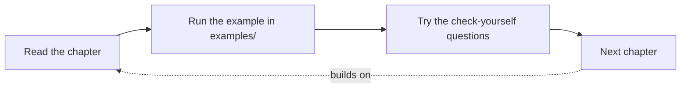

# Chapter 0 — Intro

## TL;DR

- This guide teaches Django by mapping it onto the JS/Node tools you already know — no assumption you've written Python before.
- One runnable project ([`examples/`](../examples/)) grows chapter by chapter. You'll clone it once, then keep pulling and running it as you go.
- Setup takes three steps: install `uv`, start Postgres with Docker, run the project.

## The mental model

Ok, before anything else: how is this guide laid out, and how should you actually work through it?

Each chapter is short on purpose. It gives you the big picture and a working example, then links out to the official docs for depth — you go deeper only when you actually need to, not upfront.



Chapters are sequential — chapter 6 assumes you've read chapter 3, and it'll link back there if it's reusing something. It's meant to be read roughly in order the first time through, then used as a reference after that.

## If you know JS: npm / nvm

You already went through a version of this setup with Node — a package manager, a way to isolate dependencies per project, a `package.json`. Django's world has direct equivalents:

| JS / Node | Django / Python |
|---|---|
| `npm` / `pnpm` | [`uv`](https://docs.astral.sh/uv/) — installs Python itself, manages dependencies, runs scripts |
| `package.json` | `pyproject.toml` |
| `node_modules/` (per project) | `.venv/` (a virtual environment, per project) |
| `nvm` (switch Node versions) | `uv` also does this for Python — no separate tool needed |
| `npm install` | `uv sync` |
| `npx <tool>` / `npm run <script>` | `uv run <command>` |

The big shift: in JS, "install a runtime version" and "manage project dependencies" are usually two different tools (`nvm` + `npm`). `uv` does both.

## The Django way

Here's the actual setup, step by step. This creates the environment you'll use for every chapter from here on.

**1. Install `uv`** — see [the official install guide](https://docs.astral.sh/uv/getting-started/installation/) for your OS.

**2. Clone the repo and start Postgres:**

```bash
git clone https://github.com/danilomsilva/django-for-js-devs.git
cd django-for-js-devs/examples
cp .env.example .env
docker compose up -d
```

**3. Install dependencies and run migrations:**

```bash
uv sync
uv run python manage.py migrate
```

**4. Run the dev server:**

```bash
uv run python manage.py runserver
```

Visit `http://127.0.0.1:8000/api/greetings/` — you should see an empty list (or a browsable API page, since DRF ships one for free). That's the whole example project responding: a Django app, backed by Postgres, exposing a REST endpoint.

**5. Run the tests:**

```bash
uv run pytest
```

Tests run against a fast in-memory SQLite database by default, so you don't need Docker running just to run the test suite — only for `runserver` and `migrate`, which touch the real database. See [`examples/README.md`](../examples/README.md) for details.

## Gotchas for JS devs

- Django's dev server (`runserver`) is genuinely a development-only server, more explicitly than something like Express with `nodemon` — production deployment always goes through something like Gunicorn (covered in chapter 24).
- There's no build step. No transpiling, no bundler. You run `.py` files (mostly) as-is.
- `uv run` is doing the job of both "activate the virtual environment" and "run the command" — you don't need to manually activate anything, unlike older Python workflows you may have seen referenced online.

## Check yourself

1. What's the closest JS/Node equivalent to `uv sync`?

   <details><summary>Answer</summary><code>npm install</code> — it reads the lockfile/manifest and installs everything the project needs.</details>

2. Why do the tests not need Docker/Postgres running, but `runserver` does?

   <details><summary>Answer</summary>Tests use a separate, fast SQLite settings file (<code>config/settings_test.py</code>) that swaps out the database. <code>runserver</code> and <code>migrate</code> use the real settings (<code>config/settings.py</code>), which point at Postgres.</details>

## Go deeper (when you need it)

- [uv documentation](https://docs.astral.sh/uv/)
- [Django installation guide](https://docs.djangoproject.com/en/5.2/topics/install/)
- [Django REST Framework quickstart](https://www.django-rest-framework.org/tutorial/quickstart/)

## Further reading & credits

- [uv docs](https://docs.astral.sh/uv/) — Astral, MIT/Apache-2.0.
- [Django docs](https://docs.djangoproject.com/) — Django Software Foundation, BSD-3-Clause.
- [Django REST Framework docs](https://www.django-rest-framework.org/) — Encode OSS, BSD-3-Clause.
