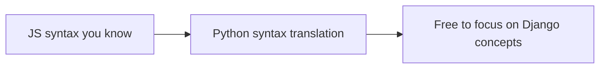

# Chapter 1 — Python survival kit

## TL;DR

- You don't need to "learn Python" before Django — you need the handful of syntax pieces Django actually uses.
- Python reads a lot like pseudocode; the main friction points for JS devs are indentation-as-syntax, `self`, and a few naming conventions.
- This chapter is a lookup table, not a tutorial — bookmark it and come back when a later chapter uses something unfamiliar.

## The mental model

Ok, before we touch Django itself: you're about to read a lot of Python in the rest of this guide, and if every unfamiliar bit of syntax is also a new concept, that's two things to learn at once. Let's separate them. This chapter is purely "what does this squiggle mean," so that from chapter 2 onward, syntax gets out of your way and you can focus on Django concepts.



## If you know JS: syntax, not semantics

Most of what's below maps directly to something you already do in JS — just spelled differently.

| JS/TS | Python | Notes |
|---|---|---|
| `{ }` blocks | indentation | Whitespace is syntax. A block is defined by consistent indentation, not braces. |
| `const x = 1` | `x = 1` | No `const`/`let`/`var` — everything is reassignable by default. |
| `` `Hello ${name}` `` | `f"Hello {name}"` | f-strings are Python's template literals. |
| `// comment` | `# comment` | |
| `null` / `undefined` | `None` | One value, not two. |
| `true` / `false` | `True` / `False` | Capitalized. |
| `===` | `==` | Python doesn't have a separate strict-equality operator — `==` already compares value and type sensibly for most cases. |
| `&&` `\|\|` `!` | `and` `or` `not` | Word operators, not symbols. |
| Arrays `[1, 2, 3]` | Lists `[1, 2, 3]` | Same syntax, same idea — ordered, mutable. |
| Objects `{ key: "value" }` | Dicts `{"key": "value"}` | Same syntax, same idea — key/value pairs. |
| Arrow function `(x) => x * 2` | Lambda `lambda x: x * 2` | Python lambdas are single-expression only — anything bigger becomes a named `def` function. |
| `function foo() { ... }` | `def foo():` | |
| `class Foo { constructor() {} }` | `class Foo:` with `def __init__(self):` | See "gotchas" below on `self`. |
| `import { x } from "./mod"` | `from mod import x` | |
| `export default` | nothing special — Python has no default export | You import exactly what a module defines. |
| Spread `...args` | `*args` | |
| Object rest `{ a, ...rest }` | `**kwargs` | Collects remaining *keyword* arguments into a dict. |
| TypeScript types `x: number` | Type hints `x: int` | Optional, not enforced at runtime — more on this below. |
| Optional chaining `a?.b` | `getattr(a, "b", None)` or just try/except | No direct operator equivalent. |
| `async function` / `await` | `async def` / `await` | Same idea, and Django supports it (more in chapter 4). |

## The Django way

A few of these deserve a closer look, since they show up in every Django file you'll read.

**Indentation is the block.** This isn't a style choice you can ignore — Python parses indentation as structure:

```python
def greet(name):
    if name:
        return f"Hello, {name}"
    return "Hello, stranger"
```

Get the indentation wrong and you get a `SyntaxError` or, worse, code that runs but does something different than you meant.

**`self` is `this`, but explicit.** In JS, `this` inside a method is implicit and can even change if you're not careful. In Python, the instance is always the first parameter of every method — by convention named `self` — and you access instance attributes through it:

```python
class Greeting:
    def __init__(self, message):
        self.message = message  # like `this.message = message` in a JS constructor

    def shout(self):
        return self.message.upper()
```

You'll see `self` in every Django model, view, and serializer method. It's not magic — it's just the instance, passed explicitly instead of implicitly.

**`*args` and `**kwargs` show up constantly in Django's class-based views and DRF.** A function signature like this:

```python
def create(self, request, *args, **kwargs):
    ...
```

means: "accept any extra positional arguments as a tuple (`args`) and any extra keyword arguments as a dict (`kwargs`), and pass them through." This is Django/DRF's way of letting you override one method without having to know every possible argument its parent class might pass in — similar in spirit to spreading `...props` through a React component.

**Decorators wrap a function, like a higher-order function with nicer syntax.** If you've written `withAuth(MyComponent)` in React, you've done this already:

```python
@login_required
def dashboard(request):
    ...
```

is roughly `dashboard = login_required(dashboard)` — `login_required` wraps your view and can block the request before your code ever runs. You'll see this pattern a lot in permissions (chapter 13).

**Type hints exist, but Python doesn't enforce them at runtime.** Unlike TypeScript, which `tsc` checks at compile time, Python type hints are documentation unless a separate tool (`mypy`, covered in chapter 22) checks them:

```python
def add(a: int, b: int) -> int:
    return a + b
```

Nothing stops you from calling `add("1", "2")` — Python will happily try and fail (or succeed unexpectedly) at runtime. Django itself doesn't require type hints anywhere.

## Gotchas for JS devs

- There's no `this` ambiguity to worry about — but you must remember to type `self` as the first parameter of every method, or Python will complain loudly.
- Python has no block scope the way `{ }` gives you in JS — a variable defined inside an `if` block is visible after it, within the same function.
- `import` statements at the top of a file can have side effects (this is exactly how Django "discovers" things like models and admin registrations) — more on this in chapter 3.
- Mutable default arguments (`def f(items=[]):`) are a classic Python trap — the list is created once and shared across calls. You'll rarely hit this in Django code you write yourself, but it's worth knowing about.

## Check yourself

1. What does `**kwargs` collect, and what's the closest JS equivalent?

   <details><summary>Answer</summary>It collects extra keyword arguments into a dict. Closest JS equivalent is object rest (<code>{ a, ...rest }</code>), though Python's version applies to function arguments specifically.</details>

2. Why does almost every method inside a Python class start with <code>self</code> as a parameter?

   <details><summary>Answer</summary>Python doesn't have an implicit <code>this</code> — the instance is passed explicitly as the first argument to every method, conventionally named <code>self</code>.</details>

3. If you write `def add(a: int, b: int) -> int:` and then call `add("x", "y")`, what happens?

   <details><summary>Answer</summary>It runs — Python type hints aren't enforced at runtime. The function would try string concatenation logic if it did `a + b`, or fail depending on what the body does. Only a separate tool like mypy would catch this before running.</details>

## Go deeper (when you need it)

- [Official Python tutorial](https://docs.python.org/3/tutorial/)
- [Python decorators, explained](https://docs.python.org/3/glossary.html#term-decorator)
- [PEP 484 — Type Hints](https://peps.python.org/pep-0484/)

## Further reading & credits

- [Python 3 documentation](https://docs.python.org/3/) — Python Software Foundation, PSF License.
