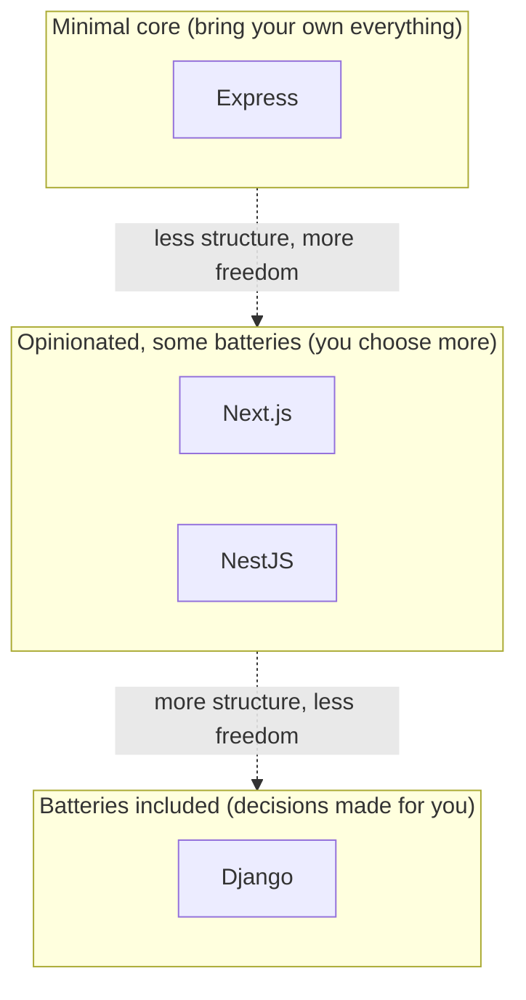

# Chapter 2 — Django philosophy

## TL;DR

- Django is "batteries included": auth, admin, ORM, forms, and more ship in the box, versus Express's minimal core plus a plugin per feature.
- Django follows MTV (Model-Template-View) — which maps to MVC, but the naming is shuffled and trips people up.
- Django is opinionated about *where things go* — once you learn the convention, every Django codebase looks familiar, the same way every NestJS project has a similar shape.

## The mental model

Ok, now that Python syntax won't slow you down (chapter 1), let's zoom out to the actual question: what kind of framework is Django, and how does it compare to the JS frameworks you already have a feel for?

Django sits at the "batteries included" end of that spectrum, further than even NestJS. Auth, admin panel, ORM, migrations, forms, templating, and internationalization are all in the standard library that ships with Django — not separate packages you have to research, pick, and wire together.

## If you know JS: Express vs Next.js/NestJS vs Django

| | Express | Next.js / NestJS | Django |
|---|---|---|---|
| Routing | You wire it up | Convention (file-based or decorators) | Convention (`urls.py`) |
| ORM | Pick one (Prisma, Drizzle...) | Pick one | Included (`django.db.models`) |
| Auth | Pick a library (Passport...) | Pick a library | Included (`django.contrib.auth`) |
| Admin UI | Build it yourself or add AdminJS | Build it yourself | Included (`django.contrib.admin`) — free CRUD UI from your models |
| Migrations | Pick a tool (or none) | Pick a tool | Included (`makemigrations` / `migrate`) |
| Project structure | Up to you | Convention, some flexibility | Convention, low flexibility |

The trade-off: Express gives you freedom and a minimal mental footprint per feature you don't use. Django gives you a lot for free, at the cost of doing things "the Django way" even when you might have picked something else from scratch. Most teams find the trade worth it, especially early on — you're not evaluating and integrating five separate libraries before you can accept your first HTTP request with a database behind it.

## The Django way

**MTV, not MVC.** Django calls its pattern Model-Template-View, and the names don't line up with what you'd expect from MVC:

| MVC term (what you might expect) | Django's actual name | What it does |
|---|---|---|
| Model | Model | Same as MVC — the ORM: fields, relations (chapter 6) |
| View (the template) | Template | The HTML-rendering layer (mostly irrelevant to you — see below) |
| Controller (the logic) | View | The function/class that receives a request and returns a response (chapter 5) |

So a Django "view" is what you'd call a *controller* or a route handler in Express — the thing that takes a request and decides what to do. This is the single most common point of confusion for anyone reading Django code for the first time, JS background or not. Keep this table handy for the next few chapters.

**Where you'll actually spend your time.** Since this guide is aimed at JS devs building APIs for a React frontend, the "Template" part of MTV — Django's server-side HTML templating — is mostly out of scope. Django REST Framework (Part 3, starting chapter 10) replaces templates with JSON responses, which is the setup you'll use for anything React-facing.

**Convention over configuration, applied literally.** A Django project is split into a **project** (the overall configuration — settings, root URLs) and one or more **apps** (self-contained features — e.g. `greetings`, `orders`, `users`). This isn't a suggestion; `django-admin startapp` scaffolds the exact file layout Django expects, and the next chapter walks through it file by file.

## Gotchas for JS devs

- "View" means controller, not the rendered page. This will trip you up in every Django doc you read until it clicks.
- Django's admin panel is genuinely production-usable for internal tools — it's not just a dev convenience. Chapter 8 covers it.
- Because so much is included, a lot of Django's documentation reads as "how to configure the built-in thing" rather than "how to pick a library" — the decisions are already made, which is faster once you're used to it, but can feel restrictive coming from an ecosystem of choices.

## Check yourself

1. In Django's MTV pattern, which part corresponds to a controller/route handler in Express?

   

Answer
The <b>View</b> — despite the name, it's the request-handling logic, not the rendered page.

2. Name two things Django includes out of the box that you'd typically have to choose a separate library for in an Express project.

   

Answer
Any two of: ORM, auth, admin UI, migrations, forms, templating. (Express has none of these built in — you pick a package for each.)

## Go deeper (when you need it)

- [Django design philosophies](https://docs.djangoproject.com/en/5.2/misc/design-philosophies/)
- [Django FAQ: general](https://docs.djangoproject.com/en/5.2/faq/general/)

## Further reading & credits

- [Django docs — design philosophies](https://docs.djangoproject.com/en/5.2/misc/design-philosophies/) — Django Software Foundation, BSD-3-Clause.
- [Express.js](https://expressjs.com/) — OpenJS Foundation, MIT.
- [NestJS](https://nestjs.com/) — MIT.
