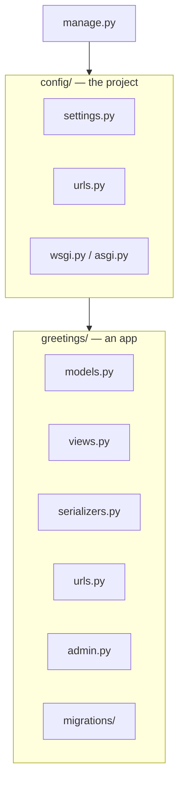

# Chapter 3 — Project anatomy

## TL;DR

- A Django **project** is the overall configuration (settings, root URLs); a Django **app** is one self-contained feature.
- `manage.py` is your CLI entry point — think of it as a built-in `npm run <script>` for Django-specific tasks.
- The file layout `startapp`/`startproject` generates isn't a suggestion — Django's tooling expects it.

## The mental model

Ok, we now know Django is "batteries included" and that "view" means controller (chapter 2). Let's get concrete: what files actually exist in a Django codebase, and what does each one do? We'll use [`examples/`](../examples/) itself as the map.



## If you know JS: Express app vs. feature modules / NestJS modules

| Django | Closest JS equivalent |
|---|---|
| The project (`config/`) | Your `app.js`/`server.js` + global config (`.env`, CORS, top-level router) |
| An app (`greetings/`) | A feature module — a NestJS module, or a folder of routes+controller+service in Express |
| `manage.py` | `package.json` scripts, run via `npm run <script>` |
| `INSTALLED_APPS` in settings | Registering a module in `app.module.ts` (NestJS), or mounting a router in Express |

The key mental shift: in Express, you decide the folder structure. In Django, `startapp` generates it, and Django's tooling (migrations, admin, the test runner) all assume you kept it.

## The Django way

Here's the actual file map, from [`examples/`](../examples/):

```
examples/
├── manage.py              # CLI entry point — like a script runner
├── config/                 # the PROJECT
│   ├── settings.py          # global config (chapter 9)
│   ├── settings_test.py     # test-only override (SQLite instead of Postgres)
│   ├── urls.py               # root URL routing (chapter 5)
│   ├── wsgi.py / asgi.py     # entry points for production servers (chapter 24)
│   └── __init__.py
└── greetings/               # an APP
    ├── models.py             # ORM models (chapter 6)
    ├── serializers.py        # DRF serializers (chapter 11)
    ├── views.py              # request handlers (chapter 5)
    ├── urls.py               # this app's routes, included by config/urls.py
    ├── admin.py              # admin registration (chapter 8)
    ├── apps.py               # app config (rarely touched)
    ├── migrations/           # generated schema history (chapter 7)
    └── tests.py              # tests for this app (chapter 21)
```

A project has exactly one `config/`-style directory. It can have any number of apps — each one is meant to be a cohesive, somewhat independent feature. `greetings` here is deliberately tiny; by the time you reach chapter 6, you'll add more apps as the example project grows.

**`manage.py` is how you talk to Django.** Every command you've already run in chapter 0 goes through it:

```bash
uv run python manage.py runserver     # start dev server
uv run python manage.py migrate       # apply migrations
uv run python manage.py makemigrations  # generate migrations from model changes
uv run python manage.py startapp <name>  # scaffold a new app
```

**How Django finds an app.** Nothing happens automatically just because a folder exists — the app has to be listed in `INSTALLED_APPS` in `config/settings.py`:

```python
INSTALLED_APPS = [
    ...
    "rest_framework",
    "greetings",
]
```

This is the one manual wiring step Express devs will find familiar — it's exactly like registering a module.

## Gotchas for JS devs

- An app is not the same thing as a package you'd `npm install` — it's just a Python module with a conventional shape, living inside your own project.
- Nothing stops you from putting everything in one giant app, but Django's convention (and most of the ecosystem's advice) is to keep apps small and feature-scoped, closer to how you'd split NestJS modules than how you might structure a small Express app.
- `apps.py` rarely needs edits — Django generates it and it mostly matters for advanced cases (custom signals wiring, app-specific config).

## Check yourself

1. What's the difference between a Django "project" and a Django "app"?

   <details><summary>Answer</summary>The project is the overall configuration (one per codebase) — settings, root URLs. An app is a self-contained feature module (a codebase can have many).</details>

2. If you create a new app with `startapp` but nothing seems to register — no migrations, no admin — what's the most likely missing step?

   <details><summary>Answer</summary>Adding the app to <code>INSTALLED_APPS</code> in <code>settings.py</code>. Django won't discover an app just because the folder exists.</details>

## Go deeper (when you need it)

- [Django docs — applications](https://docs.djangoproject.com/en/5.2/ref/applications/)
- [`django-admin` and `manage.py`](https://docs.djangoproject.com/en/5.2/ref/django-admin/)

## Further reading & credits

- [Django docs — applications](https://docs.djangoproject.com/en/5.2/ref/applications/) — Django Software Foundation, BSD-3-Clause.
