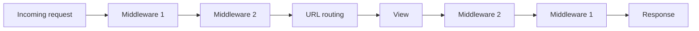

# Chapter 4 — Request lifecycle

## TL;DR

- A request flows through middleware → URL routing → view → (middleware again, on the way out).
- Django middleware is conceptually identical to Express middleware: ordered functions that wrap the request/response.
- WSGI is the synchronous protocol Django has always used; ASGI is the newer async-capable one — both exist side by side.

## The mental model

Ok, we've seen the file layout (chapter 3) — `config/` holds settings and root URLs, `greetings/` holds the app logic. Now: when an HTTP request actually arrives, what order do those files get touched in?



Each middleware gets a chance to act before the view runs (on the way in) and after it returns (on the way out) — same shape as Express's `next()` chain, just written slightly differently.

## If you know JS: Express middleware pipeline

```js
// Express
app.use((req, res, next) => {
  const start = Date.now();
  res.on("finish", () => {
    res.setHeader("X-Response-Time-Ms", Date.now() - start);
  });
  next();
});
```

```python
# Django — examples/greetings/middleware.py
class TimingMiddleware:
    def __init__(self, get_response):
        self.get_response = get_response  # runs once, at server startup

    def __call__(self, request):
        start = time.monotonic()
        response = self.get_response(request)  # this is your `next()`
        elapsed_ms = (time.monotonic() - start) * 1000
        response["X-Response-Time-Ms"] = f"{elapsed_ms:.2f}"
        return response
```

The shape is the same: capture something before, call through to the rest of the pipeline, do something with the result after. The difference is mechanical — Express passes `next` as a callback per-request; Django wraps the *entire remaining pipeline* once (`get_response`, captured at startup) and calls it like a function.

| Express | Django |
|---|---|
| `app.use(middleware)` | Listed in `MIDDLEWARE` in `settings.py`, top to bottom |
| `next()` | `self.get_response(request)` |
| Runs for every request unless skipped | Same — every middleware in the list runs for every request |
| Order matters (auth before your route handler, etc.) | Order matters — read top-to-bottom on the way in, bottom-to-top on the way out |

## The Django way

See [`examples/greetings/middleware.py`](../examples/greetings/middleware.py) — `TimingMiddleware` adds an `X-Response-Time-Ms` header to every response. It's registered in [`examples/config/settings.py`](../examples/config/settings.py):

```python
MIDDLEWARE = [
    "django.middleware.security.SecurityMiddleware",
    "django.contrib.sessions.middleware.SessionMiddleware",
    "django.middleware.common.CommonMiddleware",
    "django.middleware.csrf.CsrfViewMiddleware",
    "django.contrib.auth.middleware.AuthenticationMiddleware",
    "django.contrib.messages.middleware.MessageMiddleware",
    "django.middleware.clickjacking.XFrameOptionsMiddleware",
    "greetings.middleware.TimingMiddleware",
]
```

Notice Django already ships several built-in middlewares — security headers, session handling, CSRF protection, auth. This is the "batteries included" theme from chapter 2 again: things you'd add via `helmet`, `express-session`, or `csurf` in Express are already wired in.

[`examples/greetings/tests.py`](../examples/greetings/tests.py) has a test confirming the header shows up on a real response — `test_timing_middleware_adds_header`.

**WSGI vs ASGI, briefly.** `config/wsgi.py` and `config/asgi.py` are two different entry points for running Django in production (chapter 24 covers deployment). WSGI is Django's original, synchronous protocol — one request handled at a time per worker, similar in spirit to a traditional Node HTTP server without async handling. ASGI is the newer protocol that supports async views, WebSockets, and long-lived connections. You don't have to choose between them for the views you write — a view can be `def` (sync) or `async def` (async) regardless — but the server you deploy with needs to match (Gunicorn typically for WSGI, Uvicorn/Daphne for ASGI).

## Gotchas for JS devs

- Middleware order is a common source of bugs — e.g. `AuthenticationMiddleware` has to run before anything that reads `request.user`. Same failure mode as putting `express.json()` after your route handlers.
- Django middleware is defined once at startup (`__init__`), not per-request — don't put per-request setup logic there; it belongs in `__call__`.
- Unlike some Express setups where middleware is scoped per-router, Django's `MIDDLEWARE` list is global by default. Per-view behavior (e.g. only requiring auth on some endpoints) is handled differently — via decorators or DRF permission classes (chapter 13), not by scoping middleware.

## Check yourself

1. In the Django middleware pipeline, what does `get_response` represent?

   <details><summary>Answer</summary>The rest of the pipeline (every middleware after this one, plus the view) — calling it is equivalent to calling <code>next()</code> in Express, except it returns the eventual response rather than just continuing.</details>

2. Why must `AuthenticationMiddleware` be listed before any middleware or view that reads `request.user`?

   <details><summary>Answer</summary>Middleware runs top-to-bottom on the way in. If a middleware or view that depends on <code>request.user</code> runs before <code>AuthenticationMiddleware</code> has set it, it won't be available yet.</details>

## Go deeper (when you need it)

- [Django docs — middleware](https://docs.djangoproject.com/en/5.2/topics/http/middleware/)
- [Django docs — WSGI overview](https://docs.djangoproject.com/en/5.2/howto/deployment/wsgi/)
- [Django docs — ASGI overview](https://docs.djangoproject.com/en/5.2/howto/deployment/asgi/)

## Further reading & credits

- [Django docs — middleware](https://docs.djangoproject.com/en/5.2/topics/http/middleware/) — Django Software Foundation, BSD-3-Clause.
- [Express.js middleware guide](https://expressjs.com/en/guide/using-middleware.html) — OpenJS Foundation, MIT.
