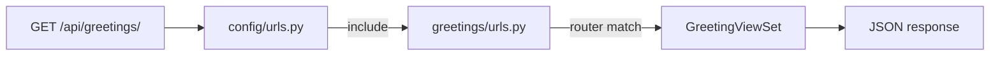

# Chapter 5 — URLs & views

## TL;DR

- `urls.py` is Django's router — it maps a URL pattern to a view, same job as `app.get("/path", handler)` in Express.
- A Django "view" (remember, chapter 2: it means controller) can be a plain function or a class — DRF's class-based `ViewSet` is what you'll use most for APIs.
- Apps register their own `urls.py`, and the project's root `urls.py` includes them — this is how routing stays modular as the app grows.

## The mental model

Ok, we've seen a request travel through middleware (chapter 4) and arrive somewhere. That "somewhere" is decided by URL routing, which then hands off to a view. Let's look at both halves.



## If you know JS: Router + handlers

```js
// Express
const router = express.Router();
router.get("/greetings", listGreetings);
router.post("/greetings", createGreeting);

app.use("/api", router);
```

```python
# Django — examples/greetings/urls.py
from rest_framework.routers import DefaultRouter
from .views import GreetingViewSet, ping

router = DefaultRouter()
router.register("greetings", GreetingViewSet, basename="greeting")

urlpatterns = [
    path("ping/", ping, name="ping"),
    *router.urls,
]

# examples/config/urls.py
urlpatterns = [
    path("admin/", admin.site.urls),
    path("api/", include("greetings.urls")),   # like app.use("/api", router)
]
```

DRF's `DefaultRouter` is doing something Express doesn't do for you automatically: from one `GreetingViewSet` class, it generates the full set of REST routes (list, create, retrieve, update, delete) with the right HTTP methods and URL patterns. In Express, you'd write each of those five route/handler pairs by hand, or reach for a convention library.

## The Django way

**Function-based views (FBVs)** are the simplest case — a plain function that takes a request and returns a response. [`examples/greetings/views.py`](../examples/greetings/views.py) has one:

```python
@api_view(["GET"])
def ping(request):
    return Response({"status": "ok"})
```

This is the most direct equivalent to an Express route handler — one function, one job.

**Class-based views (CBVs)**, and specifically DRF's `ViewSet`, bundle related behavior together. The same file defines:

```python
class GreetingViewSet(viewsets.ModelViewSet):
    queryset = Greeting.objects.all()
    serializer_class = GreetingSerializer
```

Those two lines generate list/create/retrieve/update/partial_update/destroy — every standard CRUD operation for `Greeting` — because `ModelViewSet` already knows how to do each of those, given a queryset and a serializer. You're not writing five functions; you're describing *what* the resource is and letting DRF handle the *how*. Chapter 10 goes deeper into this hierarchy (`APIView` → `ViewSet` → `ModelViewSet`).

**Routing is two-level: app, then project.** Each app owns its own `urls.py` — `greetings/urls.py` here — and the root `config/urls.py` `include()`s it under a prefix (`api/`). This mirrors mounting a sub-router under a path prefix in Express, and it's what lets you add a second app later (say, `orders/`) without touching `greetings/urls.py` at all.

Try it: `GET /api/ping/` and `GET /api/greetings/` both work against the running dev server (chapter 0), and both are covered by tests in [`examples/greetings/tests.py`](../examples/greetings/tests.py) (`test_ping_endpoint`, `test_greetings_list_endpoint`).

## Gotchas for JS devs

- URL patterns in Django are matched top-to-bottom, first match wins — same as Express route order mattering.
- `DefaultRouter` generates URL *names* too (e.g. `greeting-list`, `greeting-detail`) — useful for reversing URLs in code instead of hardcoding strings, closer to named routes in some JS frameworks than to typical Express usage.
- A trailing slash matters. Django's default behavior redirects `/api/greetings` to `/api/greetings/` (via `APPEND_SLASH`) rather than treating them as the same route outright — this can surprise API clients that don't follow redirects.

## Check yourself

1. What's the difference between a function-based view and `ModelViewSet` in terms of how many routes each one produces?

   <details><summary>Answer</summary>A function-based view handles exactly the route(s) you wire it to explicitly. <code>ModelViewSet</code>, combined with a router, generates a full set of CRUD routes (list, create, retrieve, update, partial update, destroy) from one class definition.</details>

2. Why does `greetings/urls.py` exist separately from `config/urls.py`, instead of putting everything in one file?

   <details><summary>Answer</summary>So routing stays modular per app — <code>config/urls.py</code> just <code>include()</code>s each app's routes under a prefix, the same way you'd mount a sub-router under a path in Express, without needing to know that app's internal route details.</details>

## Go deeper (when you need it)

- [Django docs — URL dispatcher](https://docs.djangoproject.com/en/5.2/topics/http/urls/)
- [DRF docs — routers](https://www.django-rest-framework.org/api-guide/routers/)
- [DRF docs — views](https://www.django-rest-framework.org/api-guide/views/)

## Further reading & credits

- [Django docs — URL dispatcher](https://docs.djangoproject.com/en/5.2/topics/http/urls/) — Django Software Foundation, BSD-3-Clause.
- [DRF docs — routers](https://www.django-rest-framework.org/api-guide/routers/) — Encode OSS, BSD-3-Clause.
