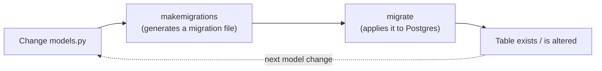

# Chapter 7 — Migrations

## TL;DR

- `makemigrations` generates migration files from changes to your models; `migrate` applies them to the database.
- Migrations are files, checked into git — they're your schema's history, similar in spirit to Prisma's migration folder.
- Django tracks which migrations have already run in the database itself, so `migrate` is safe to run repeatedly.

## The mental model

Ok, we've defined models with relations (chapter 6) — but a Python class isn't a database table by itself. Something has to translate `class Greeting(models.Model): ...` into actual SQL that creates or alters a table. That's what migrations do.



## If you know JS: `prisma migrate`

| Prisma | Django |
|---|---|
| Edit `schema.prisma` | Edit `models.py` |
| `prisma migrate dev` | `makemigrations` then `migrate` (two explicit steps) |
| Migration SQL files in `prisma/migrations/` | Python migration files in `<app>/migrations/` |
| `prisma migrate deploy` (production) | `migrate` (same command, no separate "deploy" mode) |

The main difference: Prisma's `migrate dev` generates *and* applies in one command. Django splits it into two — `makemigrations` (generate) and `migrate` (apply) — which means you can review the generated migration file before it touches any database.

## The Django way

Every time you change `models.py`, generate a migration:

```bash
uv run python manage.py makemigrations greetings
```

This is exactly what happened twice already in this project's history:

- [`0001_initial.py`](../examples/greetings/migrations/0001_initial.py) — created the `Greeting` table (chapter 1 of the example project's life).
- [`0002_greetingcategory_greeting_category.py`](../examples/greetings/migrations/0002_greetingcategory_greeting_category.py) — added `GreetingCategory` and the `category` foreign key, when chapter 6 introduced the relation.

Open either file — it's plain Python, using `django.db.migrations.Migration` operations like `CreateModel` and `AddField`. You're not meant to write these by hand day-to-day (Django generates them), but they're readable, diffable in a PR, and safe to check into git — this is your schema's history, same role as Prisma's migration SQL files.

Then apply them:

```bash
uv run python manage.py migrate
```

Django tracks applied migrations in a table it manages itself (`django_migrations`), so running `migrate` again when nothing's changed is a no-op — safe to include in every deploy step (chapter 24).

**Data migrations.** Sometimes a change isn't about the schema but the data — e.g. backfilling a new field. Django supports this with an empty migration you fill in yourself:

```bash
uv run python manage.py makemigrations greetings --empty --name backfill_something
```

This isn't used yet in `examples/`, but you'll recognize the pattern when a later chapter needs one.

## Gotchas for JS devs

- Forgetting to run `makemigrations` after changing a model is the single most common Django mistake for newcomers — the model change exists in Python, but the database doesn't know about it until a migration is generated *and* applied.
- Migration files are generated with a numeric prefix (`0001_`, `0002_`) that encodes order and dependencies — don't rename or reorder them manually.
- If two branches both add migrations independently, you can get a conflict Django calls "migrations not in a linear history" — resolvable with `makemigrations --merge`. Rare in a small team, but worth knowing the fix exists.

## Check yourself

1. What's the difference between `makemigrations` and `migrate`?

   <details><summary>Answer</summary><code>makemigrations</code> generates a migration file from model changes (doesn't touch the database). <code>migrate</code> applies pending migration files to the actual database.</details>

2. Why is it safe to run `migrate` multiple times, even if nothing changed?

   <details><summary>Answer</summary>Django records which migrations have already been applied in its own <code>django_migrations</code> table, so it skips anything already run.</details>

## Go deeper (when you need it)

- [Django docs — migrations](https://docs.djangoproject.com/en/5.2/topics/migrations/)
- [Django docs — data migrations](https://docs.djangoproject.com/en/5.2/topics/migrations/#data-migrations)

## Further reading & credits

- [Django docs — migrations](https://docs.djangoproject.com/en/5.2/topics/migrations/) — Django Software Foundation, BSD-3-Clause.
- [Prisma Migrate docs](https://www.prisma.io/docs/orm/prisma-migrate) — Prisma, Apache-2.0.
