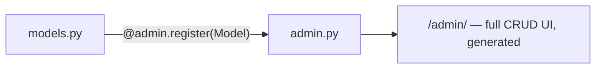

# Chapter 8 — Admin

## TL;DR

- Registering a model with `admin.py` gives you a full CRUD UI for it — for free, no frontend code written.
- It's genuinely usable for internal tools and data management, not just a dev convenience.
- Closest JS comparison: Prisma Studio (a DB browser) if you want the read/edit-rows experience; AdminJS if you want a full permissioned admin panel — Django's admin does both out of the box.

## The mental model

Ok, we've got models with relations (chapter 6) and migrations to create the tables (chapter 7). Now: how do you actually look at and edit that data without writing a UI or running raw SQL? Django's answer is the admin app, which is already installed — it's been in `INSTALLED_APPS` since chapter 0, you just haven't registered anything with it yet.



## If you know JS: Prisma Studio / AdminJS

| | Prisma Studio | AdminJS | Django Admin |
|---|---|---|---|
| What it is | A DB browser (view/edit raw rows) | A configurable admin panel | Both — browse/edit rows, with permissions and customization |
| Setup | `npx prisma studio` — zero config | Wire up a resource per model | `@admin.register(Model)` per model |
| Permissions | None (dev tool only) | Configurable | Built on Django's actual auth/permission system (chapter 12–13) — the same permissions your API uses |
| Production-ready? | No — dev only | Yes | Yes |

The meaningful difference: Django's admin isn't a separate tool bolted on — it's built on the exact same models, querysets, and permission system the rest of your app uses. Give a staff user model-level permissions, and the admin respects them automatically.

## The Django way

Registering a model takes one decorator. [`examples/greetings/admin.py`](../examples/greetings/admin.py):

```python
from django.contrib import admin
from .models import Greeting, GreetingCategory


@admin.register(Greeting)
class GreetingAdmin(admin.ModelAdmin):
    list_display = ["message", "category", "created_at"]
    list_filter = ["category"]


@admin.register(GreetingCategory)
class GreetingCategoryAdmin(admin.ModelAdmin):
    list_display = ["name"]
```

`list_display` controls which columns show up in the list view; `list_filter` adds a sidebar filter — here, filtering greetings by category. This is a handful of lines for what would otherwise be a table component, a filter UI, and CRUD forms in a hand-built admin.

To actually use it:

```bash
uv run python manage.py createsuperuser
uv run python manage.py runserver
```

Then visit `http://127.0.0.1:8000/admin/` and log in — you'll see both `Greeting` and `Greeting categories` (Django pluralizes the model name; `GreetingCategoryAdmin`'s `Meta.verbose_name_plural` on the model controls this, as set in `models.py`).

`ModelAdmin` has a lot more available — `search_fields`, `readonly_fields`, inline editing of related models (e.g. editing a category's greetings from the category page), custom actions. This chapter only covers the entry point; the "go deeper" links below cover the rest.

## Gotchas for JS devs

- The admin is a first-party Django app, not a plugin someone maintains separately — it ships with every Django install and evolves alongside the framework.
- It uses the same `django.contrib.auth` users/permissions as everything else — an admin user isn't a separate concept from an API user, just a user with `is_staff=True` and the relevant permissions.
- It's easy to over-rely on it as a stand-in for building real internal tooling — fine for a small team's data management, but it's not a replacement for a proper internal dashboard once your needs get specific (custom bulk actions, non-CRUD workflows, etc.).

## Check yourself

1. What's the minimum needed to get a working CRUD UI for a model in the admin?

   <details><summary>Answer</summary><code>@admin.register(Model)</code> above a (possibly empty) <code>ModelAdmin</code> subclass in that app's <code>admin.py</code>.</details>

2. How does Django admin's permission model relate to your API's permission model?

   <details><summary>Answer</summary>They're the same system — <code>django.contrib.auth</code> users and permissions. The admin isn't a separately permissioned tool; it enforces the same rules your API views can check (chapter 13).</details>

## Go deeper (when you need it)

- [Django docs — the admin site](https://docs.djangoproject.com/en/5.2/ref/contrib/admin/)
- [Django docs — `ModelAdmin` options](https://docs.djangoproject.com/en/5.2/ref/contrib/admin/#modeladmin-options)

## Further reading & credits

- [Django docs — admin](https://docs.djangoproject.com/en/5.2/ref/contrib/admin/) — Django Software Foundation, BSD-3-Clause.
- [Prisma Studio](https://www.prisma.io/studio) — Prisma, Apache-2.0.
