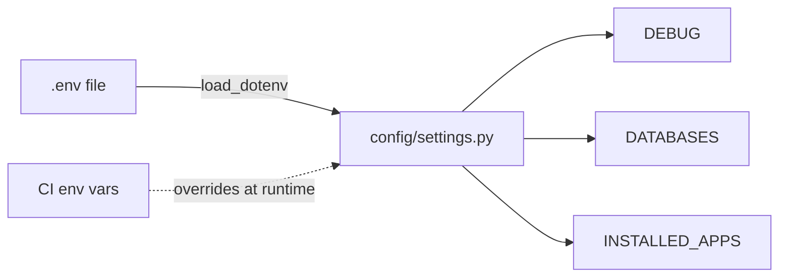

# Chapter 9 — Settings & environments

## TL;DR

- `settings.py` is one Python module holding all of Django's configuration — no separate config format to learn.
- Environment variables work the same way you're used to: a `.env` file, loaded at startup, read via `os.environ`.
- Django doesn't have a built-in "environments" concept (dev/staging/prod) — you build that yourself, usually with env vars and/or multiple settings files.

## The mental model

Ok, we've now touched most of the pieces a request travels through — middleware (chapter 4), routing (chapter 5), models (chapter 6), the admin (chapter 8). All of them read configuration from one place. Let's look at that place, and how it changes between your machine, CI, and production.



## If you know JS: dotenv

```js
// Node
require("dotenv").config();
const dbHost = process.env.POSTGRES_HOST || "localhost";
```

```python
# examples/config/settings.py
from dotenv import load_dotenv
load_dotenv(BASE_DIR / ".env")

DATABASES = {
    "default": {
        "HOST": os.environ.get("POSTGRES_HOST", "localhost"),
        ...
    }
}
```

Same pattern, same library family even — `python-dotenv` is the direct counterpart to Node's `dotenv`. [`examples/.env.example`](../examples/.env.example) documents every variable the project reads; you copy it to `.env` (gitignored) and fill in real values, exactly like you would in a Node project.

| Node / dotenv | Django |
|---|---|
| `.env` + `dotenv` | `.env` + `python-dotenv` (same idea) |
| `process.env.X` | `os.environ.get("X")` |
| `.env.example` committed, `.env` gitignored | Same convention |
| Config scattered across files that each read `process.env` | Centralized in one `settings.py` — every other file imports from `django.conf.settings` |

## The Django way

Everything lives in `config/settings.py`, and env vars control the parts that differ between machines:

```python
SECRET_KEY = os.environ.get("DJANGO_SECRET_KEY", "django-insecure-...")
DEBUG = os.environ.get("DJANGO_DEBUG", "true").lower() == "true"
ALLOWED_HOSTS = os.environ.get("DJANGO_ALLOWED_HOSTS", "localhost,127.0.0.1").split(",")

DATABASES = {
    "default": {
        "ENGINE": "django.db.backends.postgresql",
        "NAME": os.environ.get("POSTGRES_DB", "django_for_js_devs"),
        "USER": os.environ.get("POSTGRES_USER", "django"),
        "PASSWORD": os.environ.get("POSTGRES_PASSWORD", "django"),
        "HOST": os.environ.get("POSTGRES_HOST", "localhost"),
        "PORT": os.environ.get("POSTGRES_PORT", "5432"),
    }
}
```

Anywhere else in the codebase that needs a setting imports it from Django's settings object, not from `os.environ` directly:

```python
from django.conf import settings
settings.DEBUG  # not os.environ.get("DJANGO_DEBUG")
```

This indirection is worth keeping — it means test overrides (see below) and any future settings logic stay in one place.

**"Environments" are a convention, not a Django feature.** Unlike some frameworks with built-in `NODE_ENV`-style environment switching, Django just gives you one settings module and lets you decide how to vary it. This project uses the simplest approach that scales fine for a small project: one `settings.py`, controlled by env vars, plus a second file for test overrides:

```python
# examples/config/settings_test.py
from .settings import *

DATABASES = {
    "default": {"ENGINE": "django.db.backends.sqlite3", "NAME": ":memory:"}
}
```

`settings_test.py` imports everything from `settings.py` and overrides just the database, so tests run fast against in-memory SQLite without needing Postgres running (chapter 21 covers testing in depth). Which settings module is active is controlled by the `DJANGO_SETTINGS_MODULE` env var — `manage.py` defaults to `config.settings`, while `pytest` is configured (in `pyproject.toml`) to default to `config.settings_test`. CI explicitly sets `DJANGO_SETTINGS_MODULE=config.settings` to run the full suite against real Postgres instead (see [`.github/workflows/ci.yml`](../.github/workflows/ci.yml)).

Larger Django projects sometimes split further — `settings/base.py`, `settings/dev.py`, `settings/prod.py` — but the env-var-driven single file scales fine until you have a concrete reason to split.

## Gotchas for JS devs

- There's no framework-enforced `NODE_ENV`/environment concept — "dev vs prod" is whatever pattern you (or your team) decide on. This project uses env vars on one settings module; you'll see other patterns in the wild.
- `SECRET_KEY` has a real, non-cosmetic purpose (session/cookie signing, CSRF tokens) — never ship the default `django-insecure-...` value to production. It must come from an env var there.
- `DEBUG=True` in production is a genuine security issue, not just a style preference — it exposes stack traces (including settings values) to anyone who can trigger an error.

## Check yourself

1. Why does code elsewhere in the project import from `django.conf.settings` rather than reading `os.environ` directly?

   <details><summary>Answer</summary>To keep configuration reads centralized in one place (<code>settings.py</code>), so overrides — like <code>settings_test.py</code> swapping the database — apply consistently without every file needing its own env-var logic.</details>

2. How does the test suite avoid needing Postgres running locally, while CI still tests against real Postgres?

   <details><summary>Answer</summary><code>settings_test.py</code> overrides <code>DATABASES</code> to SQLite and is the default via <code>pyproject.toml</code> for local <code>pytest</code> runs. CI explicitly sets <code>DJANGO_SETTINGS_MODULE=config.settings</code> to use the real Postgres-backed settings instead.</details>

## Go deeper (when you need it)

- [Django docs — settings](https://docs.djangoproject.com/en/5.2/topics/settings/)
- [Django docs — deployment checklist](https://docs.djangoproject.com/en/5.2/howto/deployment/checklist/) (covers `DEBUG`, `SECRET_KEY`, `ALLOWED_HOSTS` for production)

## Further reading & credits

- [Django docs — settings](https://docs.djangoproject.com/en/5.2/topics/settings/) — Django Software Foundation, BSD-3-Clause.
- [python-dotenv](https://pypi.org/project/python-dotenv/) — MIT.
