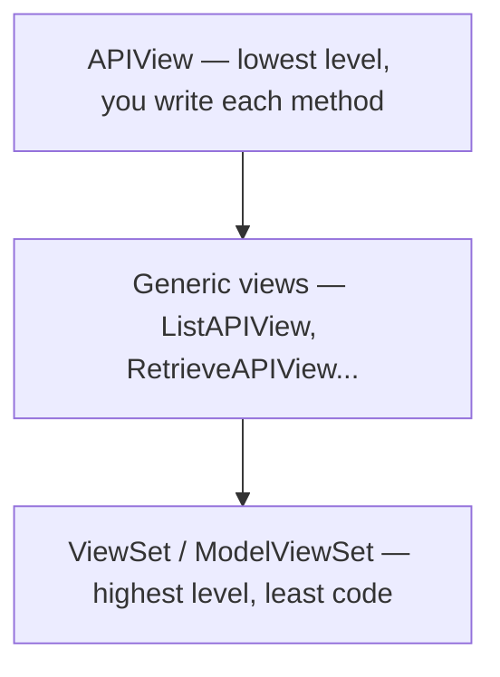

# Chapter 10 — DRF intro

## TL;DR

- Django REST Framework (DRF) is a toolkit built on top of Django specifically for building APIs — Django itself is HTML-first by default.
- DRF's view hierarchy — `APIView` → generic views → `ViewSet` — trades flexibility for less code as you go up.
- Everything you've already seen in `greetings/views.py` (`ping`, `GreetingViewSet`) is DRF, introduced gradually since chapter 5 — this chapter names what you've been using.

## The mental model

Ok, we've been using DRF since chapter 5 without naming it directly. Let's step back: Django's built-in views are meant for returning HTML via templates (chapter 2's "Template" in MTV). For a React frontend, you want JSON, status codes, content negotiation, and browsable docs — that's what DRF adds on top.



Higher up this ladder means less code for standard CRUD, but less control over exactly what each endpoint does. `GreetingViewSet` sits at the top — two lines of configuration produced a full CRUD API.

## If you know JS: Express + Router for REST APIs

| Express (raw) | DRF |
|---|---|
| Write each route handler by hand | `APIView` — closest equivalent, one method per HTTP verb |
| A convention library adds CRUD scaffolding | Generic views — one class, a few attributes, one operation each |
| — (no direct Express equivalent; NestJS controllers get closer) | `ViewSet` — one class, a full resource's worth of operations |

DRF doesn't have an exact Express counterpart because Express has no built-in concept of "a resource with standard operations" — you build that yourself or reach for a library. DRF's `ModelViewSet` bakes that concept in.

## The Django way

**`APIView`** — you write each HTTP method explicitly:

```python
from rest_framework.views import APIView
from rest_framework.response import Response

class PingView(APIView):
    def get(self, request):
        return Response({"status": "ok"})
```

This is the `@api_view(["GET"])`-decorated `ping` function in [`examples/greetings/views.py`](../examples/greetings/views.py), just written as a class instead of a function — `@api_view` is a shortcut for simple function-based DRF views; `APIView` is the class-based equivalent when you need more structure (e.g. multiple HTTP methods on one class).

**Generic views** add one operation each, given a queryset and serializer — e.g. `ListAPIView`, `RetrieveAPIView`, `CreateAPIView`. Not used in `examples/` yet, since `ModelViewSet` already covers the same ground for `Greeting` — but you'll reach for a generic view when you want *only* one operation on an endpoint (e.g. a read-only list with no create/update/delete).

**`ViewSet` / `ModelViewSet`** — the level `GreetingViewSet` already uses:

```python
class GreetingViewSet(viewsets.ModelViewSet):
    queryset = Greeting.objects.all()
    serializer_class = GreetingSerializer
```

Combined with `DefaultRouter` (chapter 5), this produces the full REST surface: `GET /greetings/` (list), `POST /greetings/` (create), `GET /greetings/{id}/` (retrieve), `PUT`/`PATCH /greetings/{id}/` (update), `DELETE /greetings/{id}/` (destroy) — six operations from two class attributes.

**Where to land.** Use `ModelViewSet` when a model needs standard CRUD (most cases). Drop to a generic view when you want a subset of operations. Drop to `APIView` when the endpoint doesn't map to a model at all (`ping` is a good example — there's no "Ping" model).

## Gotchas for JS devs

- `ViewSet` doesn't generate URLs by itself — it needs a router (chapter 5) to turn its methods into actual URL patterns. An `APIView` or generic view, by contrast, is wired directly with `path()`.
- DRF ships a browsable API — visiting an endpoint in a regular browser (not just `curl`/Postman) renders an HTML form for testing it. Handy in development; it's disabled by default in a production-sensible configuration if you set `DEFAULT_RENDERER_CLASSES` accordingly (not covered yet — mentioned so you're not surprised if you `curl` your API in production and get a different content type than in dev).
- "ViewSet" is unrelated to Django's built-in "class-based views" (`django.views.generic`) even though the naming sounds similar — those are for the HTML/template side of Django, not something you'll use in a React-facing API project.

## Check yourself

1. Why doesn't `ping` need a model, but `GreetingViewSet` does?

   <details><summary>Answer</summary><code>ping</code> is a plain <code>APIView</code>-level endpoint (via <code>@api_view</code>) that doesn't represent a resource — it just returns a fixed response. <code>ModelViewSet</code> specifically generates CRUD operations *for a model*, so it needs one to operate on.</details>

2. If you wanted an endpoint that only supports listing and retrieving `Greeting` (no create/update/delete), which level of the hierarchy fits best?

   <details><summary>Answer</summary>Generic views — <code>ListAPIView</code> and <code>RetrieveAPIView</code> (or combine both via <code>ListCreateAPIView</code>'s sibling <code>generics.ListAPIView</code> + a separate retrieve view) — rather than the full <code>ModelViewSet</code>, which would also add create/update/delete you don't want.</details>

## Go deeper (when you need it)

- [DRF docs — views](https://www.django-rest-framework.org/api-guide/views/)
- [DRF docs — generic views](https://www.django-rest-framework.org/api-guide/generic-views/)
- [DRF docs — viewsets](https://www.django-rest-framework.org/api-guide/viewsets/)

## Further reading & credits

- [Django REST Framework docs](https://www.django-rest-framework.org/) — Encode OSS, BSD-3-Clause.
