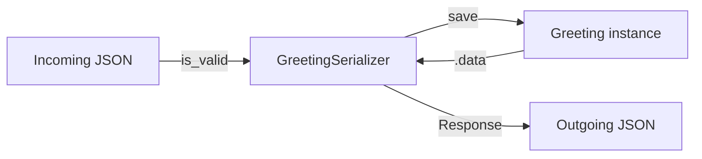

# Chapter 11 — Serializers

## TL;DR

- A DRF serializer does two jobs Zod would split into two calls: validating input, and shaping output (Python objects → JSON, and back).
- `ModelSerializer` derives fields and basic validation from the model automatically — you only write what's *different* from the model.
- `validate_<field>` methods are DRF's per-field custom validation — the counterpart to a Zod `.refine()`.

## The mental model

Ok, we've placed DRF's views in the CRUD hierarchy (chapter 10). Every one of those views needs to turn a `Greeting` model instance into JSON on the way out, and turn incoming JSON into a validated `Greeting` on the way in. That conversion-plus-validation layer is the serializer.



## If you know JS: Zod

```ts
// Zod
const GreetingSchema = z.object({
  id: z.number(),
  message: z.string().min(1, "message cannot be blank."),
  category: z.string().nullable(),
  createdAt: z.string(),
});
```

```python
# examples/greetings/serializers.py
class GreetingSerializer(serializers.ModelSerializer):
    category = serializers.SlugRelatedField(slug_field="name", read_only=True, allow_null=True)

    class Meta:
        model = Greeting
        fields = ["id", "message", "category", "created_at"]

    def validate_message(self, value):
        if value.strip() == "":
            raise serializers.ValidationError("message cannot be blank.")
        return value
```

The mental model is close to Zod's: describe the shape, describe the rules, get a validated object or a list of errors back. The difference is *where the shape comes from* — Zod schemas are always written by hand; `ModelSerializer` derives most fields from the model (`message = CharField(max_length=200)` on the model already implies a string field with a length rule on the serializer) and you only add what the model doesn't express, like the custom `validate_message` check above or the `category` field's read-only slug representation.

| Zod | DRF |
|---|---|
| `z.object({...})` written by hand | `ModelSerializer` derives fields from the model; `Serializer` (no `Model`) is fully manual, closer to Zod |
| `.parse(data)` / `.safeParse(data)` | `serializer.is_valid()` |
| Parsed result | `serializer.validated_data` |
| `.refine()` / custom `.superRefine()` | `validate_<field>()` or `validate()` (whole-object) methods |
| Errors object | `serializer.errors` |

## The Django way

**Validating incoming data**, as `GreetingViewSet.create()` does internally (you don't call this directly — `ModelViewSet` does it for you, but it's worth seeing what's happening underneath):

```python
serializer = GreetingSerializer(data=request.data)
serializer.is_valid(raise_exception=True)   # raises 400 with serializer.errors if invalid
greeting = serializer.save()                 # creates and returns the Greeting instance
```

**Serializing outgoing data** — a model instance to JSON-ready data:

```python
serializer = GreetingSerializer(greeting)
serializer.data  # {"id": 1, "message": "...", "category": "Formal", "created_at": "..."}
```

**Custom field-level validation** — [`examples/greetings/serializers.py`](../examples/greetings/serializers.py)'s `validate_message` rejects a blank-but-not-empty message (e.g. `"   "`), which the model's plain `CharField` wouldn't catch on its own:

```python
def validate_message(self, value):
    if value.strip() == "":
        raise serializers.ValidationError("message cannot be blank.")
    return value
```

[`examples/greetings/tests.py`](../examples/greetings/tests.py)'s `test_greetings_create_endpoint_rejects_blank_message` posts a whitespace-only message and checks for a 400 with an error under the `message` key — the same error shape you'd map into a React form's field error (more on that mapping in chapter 15).

**Read-only relational fields** — `category` is exposed as its name (a string), not a nested object or a raw ID, and can't be set through this endpoint (`read_only=True`):

```python
category = serializers.SlugRelatedField(slug_field="name", read_only=True, allow_null=True)
```

This is a deliberate simplification for this chapter — DRF also supports writable nested serializers and `PrimaryKeyRelatedField` for accepting an ID on write, which you'd reach for once you need to actually set the category through the API.

## Gotchas for JS devs

- `is_valid()` mutates the serializer instance rather than returning a new validated object — `validated_data` and `errors` become available as attributes afterward, which reads differently from Zod's `safeParse` returning a discriminated result object.
- `ModelSerializer` deriving fields from the model is convenient but can hide what's actually being validated — when in doubt, DRF can print the generated field definitions (`repr(serializer)`) so you can see exactly what was inferred.
- A plain `Serializer` (not `ModelSerializer`) exists for cases with no backing model — e.g. validating a search/filter query. It's fully manual, closest to writing a Zod schema from scratch.

## Check yourself

1. Why does `validate_message` need to exist, if `message` is already a `CharField(max_length=200)` on the model?

   <details><summary>Answer</summary>The model's <code>CharField</code> only enforces a max length — it doesn't reject a string that's non-empty but all whitespace. <code>validate_message</code> adds that extra rule at the serializer level.</details>

2. What's the closest Zod equivalent to `serializer.errors` after a failed `is_valid()`?

   <details><summary>Answer</summary>The <code>error</code> (or the formatted issues) from a Zod <code>safeParse</code> result — both give you a structure of field names to error messages you can map into form state.</details>

## Go deeper (when you need it)

- [DRF docs — serializers](https://www.django-rest-framework.org/api-guide/serializers/)
- [DRF docs — validators](https://www.django-rest-framework.org/api-guide/validators/)
- [DRF docs — relations](https://www.django-rest-framework.org/api-guide/relations/)

## Further reading & credits

- [DRF docs — serializers](https://www.django-rest-framework.org/api-guide/serializers/) — Encode OSS, BSD-3-Clause.
- [Zod docs](https://zod.dev/) — MIT.
