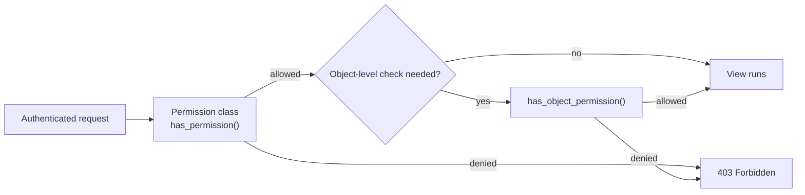

# Chapter 13 — Permissions

## TL;DR

- Authentication (chapter 12) answers "who is this?" — permissions answer "is this person allowed to do *this*?"
- DRF permissions are classes with a `has_permission` method (view-level) and optionally `has_object_permission` (per-object) — closest JS equivalent is a guard or auth middleware that checks a role/claim.
- Permissions can be set globally, per view, or (via `has_object_permission`) per individual object.

## The mental model

Ok, `whoami` (chapter 12) only checked that *someone* was logged in. But most endpoints need a finer rule than that — "anyone can read, only staff can write" is `GreetingViewSet`'s actual rule now. Let's see how that check plugs into the request pipeline.



## If you know JS: middleware / guards

```ts
// NestJS guard
@Injectable()
export class StaffOnlyGuard implements CanActivate {
  canActivate(context: ExecutionContext): boolean {
    const req = context.switchToHttp().getRequest();
    if (["GET", "HEAD"].includes(req.method)) return true;
    return req.user?.isStaff === true;
  }
}
```

```python
# examples/greetings/permissions.py
class IsStaffOrReadOnly(BasePermission):
    def has_permission(self, request, view):
        if request.method in SAFE_METHODS:
            return True
        return bool(request.user and request.user.is_staff)
```

Same shape: check the method, check something about `request.user`, return a boolean. DRF calls this once per request automatically (no manual wiring per route needed, unlike an Express middleware you'd have to attach to each route or router).

| NestJS / Express | DRF |
|---|---|
| Guard / auth middleware | Permission class |
| Applied per-route or globally via `app.useGlobalGuards()` | `permission_classes` on a view, or `DEFAULT_PERMISSION_CLASSES` globally |
| One check, at the request level | Two checks available: `has_permission` (request-level) and `has_object_permission` (per fetched object) |

## The Django way

[`examples/greetings/permissions.py`](../examples/greetings/permissions.py) defines the rule, [`examples/greetings/views.py`](../examples/greetings/views.py) applies it:

```python
class IsStaffOrReadOnly(BasePermission):
    def has_permission(self, request, view):
        if request.method in SAFE_METHODS:  # GET, HEAD, OPTIONS
            return True
        return bool(request.user and request.user.is_staff)
```

```python
class GreetingViewSet(viewsets.ModelViewSet):
    queryset = Greeting.objects.all()
    serializer_class = GreetingSerializer
    permission_classes = [IsStaffOrReadOnly]
```

Now: anyone (even unauthenticated) can `GET /api/greetings/`, but `POST`/`PUT`/`PATCH`/`DELETE` require `is_staff=True`. [`examples/greetings/tests.py`](../examples/greetings/tests.py) covers both sides — `test_greetings_create_endpoint` (staff, succeeds) and `test_greetings_create_endpoint_requires_staff` (non-staff, gets 403).

**Three levels of scope**, in order of how broadly they apply:

```python
# Global default — settings.py
REST_FRAMEWORK = {
    "DEFAULT_PERMISSION_CLASSES": ["rest_framework.permissions.IsAuthenticated"],
}

# Per-view — overrides the global default for this view only
class GreetingViewSet(viewsets.ModelViewSet):
    permission_classes = [IsStaffOrReadOnly]

# Per-object — has_object_permission(), runs only for detail-level actions
# (retrieve/update/delete), after has_permission() already passed
class IsOwnerOrReadOnly(BasePermission):
    def has_object_permission(self, request, view, obj):
        if request.method in SAFE_METHODS:
            return True
        return obj.created_by == request.user
```

That last example (`IsOwnerOrReadOnly`) isn't in `examples/` yet — `Greeting` has no owner field — but it's the standard pattern once a model does: "anyone can read, but only the creator can edit/delete *this specific one*." `has_object_permission` only runs for actions that fetch a specific object (retrieve, update, destroy), never for `list` or `create`, since there's no object yet at that point.

## Gotchas for JS devs

- `has_permission` runs for every action, including `list` and `create` — `has_object_permission` only runs for actions where DRF has already fetched a specific instance. Forgetting this means an object-level check alone won't protect `create`.
- Permission classes are combined with AND by default when you list more than one — every listed permission must return `True`. DRF also supports `|` and `&` operators between permission classes for OR/AND composition if you need it.
- `IsAuthenticated`, `IsAdminUser`, `AllowAny`, and `IsAuthenticatedOrReadOnly` ship built into DRF — check those before writing a custom class; `IsStaffOrReadOnly` here is custom only because "staff, not admin, not owner" isn't one of the built-ins.

## Check yourself

1. Why does `has_object_permission` never get called for `GreetingViewSet`'s `create` action?

   <details><summary>Answer</summary>There's no existing object yet when creating one — <code>has_object_permission</code> only runs for actions that operate on an already-fetched instance (retrieve, update, destroy), after <code>has_permission</code> has already passed.</details>

2. If you list `permission_classes = [IsAuthenticated, IsStaffOrReadOnly]`, what has to be true for a write request to succeed?

   <details><summary>Answer</summary>Both must return <code>True</code> — permissions in a list are combined with AND by default, so the user must be authenticated <i>and</i> pass the staff-or-read-only check.</details>

## Go deeper (when you need it)

- [DRF docs — permissions](https://www.django-rest-framework.org/api-guide/permissions/)

## Further reading & credits

- [DRF docs — permissions](https://www.django-rest-framework.org/api-guide/permissions/) — Encode OSS, BSD-3-Clause.
- [NestJS guards](https://docs.nestjs.com/guards) — MIT.
