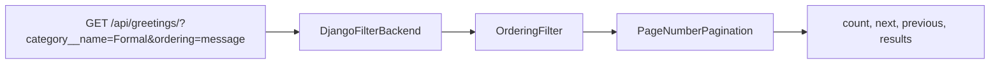

# Chapter 14 — Pagination, filtering, ordering

## TL;DR

- Pagination, filtering, and ordering are all configured declaratively on the view — no manual `LIMIT`/`OFFSET`/`WHERE` string-building.
- `django-filter` turns query params into ORM filters (`?category__name=Formal` → `.filter(category__name="Formal")`) — same job as manually reading `req.query` in Express, minus the manual part.
- This is server-side pagination/filtering, distinct from a client-side approach like TanStack Table operating on data already in the browser.

## The mental model

Ok, `GreetingViewSet` (chapters 10–13) can list, create, update, and delete — but "list everything" doesn't scale once there are thousands of greetings. Let's add the three things almost every list endpoint eventually needs: paging through results, filtering by a field, and controlling sort order.



All three run in this order automatically, before your view's own logic even sees the queryset — they're "filter backends" and a paginator, both configured, not hand-written per view.

## If you know JS: query params + ORM

```js
// Express — all manual
app.get("/greetings", async (req, res) => {
  const { category, ordering, page = 1 } = req.query;
  const where = category ? { category: { name: category } } : {};
  const orderBy = ordering ? { [ordering]: "asc" } : undefined;
  const results = await prisma.greeting.findMany({
    where, orderBy, skip: (page - 1) * 10, take: 10,
  });
  res.json(results);
});
```

```python
# DRF — declarative, on the view
class GreetingViewSet(viewsets.ModelViewSet):
    queryset = Greeting.objects.all()
    serializer_class = GreetingSerializer
    filterset_fields = ["category__name"]
    ordering_fields = ["created_at", "message"]
```

The Express version is entirely hand-rolled — reading query params, building a `where` clause, computing skip/take. The DRF version declares *which* fields are filterable/orderable; the actual query-param parsing and queryset building happens inside the configured backends, the same code path for every view that opts in.

| Concern | Express + Prisma (manual) | DRF (configured) |
|---|---|---|
| Filtering | Read `req.query`, build `where` | `filterset_fields` + `DjangoFilterBackend` |
| Ordering | Read `req.query.ordering`, build `orderBy` | `ordering_fields` + `OrderingFilter` |
| Pagination | Compute `skip`/`take` yourself | `DEFAULT_PAGINATION_CLASS` + `PAGE_SIZE`, global or per-view |
| Client-side alternative | — | TanStack Table, operating on already-fetched data (fine for small datasets, not for filtering millions of rows) |

## The Django way

All three are configured once, globally, in [`examples/config/settings.py`](../examples/config/settings.py):

```python
REST_FRAMEWORK = {
    "DEFAULT_FILTER_BACKENDS": [
        "django_filters.rest_framework.DjangoFilterBackend",
        "rest_framework.filters.OrderingFilter",
    ],
    "DEFAULT_PAGINATION_CLASS": "rest_framework.pagination.PageNumberPagination",
    "PAGE_SIZE": 10,
}
```

Then each view opts into filtering/ordering on specific fields — [`examples/greetings/views.py`](../examples/greetings/views.py):

```python
class GreetingViewSet(viewsets.ModelViewSet):
    queryset = Greeting.objects.all()
    serializer_class = GreetingSerializer
    filterset_fields = ["category__name"]
    ordering_fields = ["created_at", "message"]
```

**Filtering** — `?category__name=Formal` filters to greetings whose category name is exactly "Formal" (the double underscore is Django's ORM lookup syntax from chapter 6, exposed straight through to the query string):

```
GET /api/greetings/?category__name=Formal
```

**Ordering** — `?ordering=message` sorts ascending by message; `?ordering=-message` sorts descending:

```
GET /api/greetings/?ordering=message
```

**Pagination** happens automatically once `PAGE_SIZE` is set — the response shape changes from a bare array to an envelope:

```json
{
  "count": 12,
  "next": "http://.../api/greetings/?page=2",
  "previous": null,
  "results": [ /* up to PAGE_SIZE items */ ]
}
```

This is why [`examples/greetings/tests.py`](../examples/greetings/tests.py)'s list-related tests read `response.json()["results"]` rather than treating the response body as the array directly — `test_greetings_list_is_paginated`, `test_greetings_filter_by_category_name`, and `test_greetings_ordering` all exercise this.

## Gotchas for JS devs

- Enabling pagination changes your response shape for *every* list endpoint using the default — if you had frontend code written against a bare array, it now needs to read `.results`. This is exactly the kind of contract change chapter 16 (typed contracts) helps catch before it reaches production.
- `filterset_fields` is an allow-list — only fields you name become filterable via query params. Nothing is filterable by accident.
- `django-filter`'s double-underscore lookups mean a query param like `?category__name=Formal` directly exposes your ORM's relationship traversal to the client. That's usually fine for read-only filtering, but worth being deliberate about which fields you expose this way, especially anything sensitive.

## Check yourself

1. Why did `test_greetings_list_endpoint` (chapter 5) need to change from `response.json()[0]` to `response.json()["results"][0]` in this chapter?

   <details><summary>Answer</summary>Enabling <code>DEFAULT_PAGINATION_CLASS</code> wraps list responses in an envelope (<code>count</code>, <code>next</code>, <code>previous</code>, <code>results</code>) instead of returning a bare array.</details>

2. What determines which query params are actually usable for filtering on `GreetingViewSet`?

   <details><summary>Answer</summary><code>filterset_fields = ["category__name"]</code> — only fields explicitly listed there become filterable; it's an allow-list, not automatic for every model field.</details>

## Go deeper (when you need it)

- [DRF docs — filtering](https://www.django-rest-framework.org/api-guide/filtering/)
- [DRF docs — pagination](https://www.django-rest-framework.org/api-guide/pagination/)
- [django-filter documentation](https://django-filter.readthedocs.io/)

## Further reading & credits

- [DRF docs — filtering](https://www.django-rest-framework.org/api-guide/filtering/) — Encode OSS, BSD-3-Clause.
- [django-filter](https://django-filter.readthedocs.io/) — Carlton Gibson & contributors, BSD-3-Clause.
- [TanStack Table](https://tanstack.com/table) — MIT.
