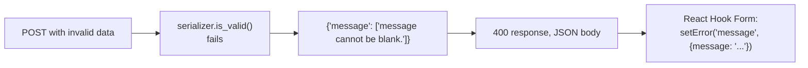

# Chapter 15 — Errors & validation

## TL;DR

- DRF's validation error shape (`{"field": ["message"]}`) maps cleanly onto React Hook Form's field errors — one key per field, an array of messages.
- A 400 means "your request was invalid" (serializer validation, chapter 11); other status codes (401, 403, 404, 500) mean something else and need different handling on the frontend.
- Non-field errors (validation that doesn't belong to one field) have their own key — don't assume every error maps to a single input.

## The mental model

Ok, `GreetingSerializer.validate_message` (chapter 11) already rejects bad input with a structured error. This chapter is about the other side: what that error actually looks like over the wire, and how it becomes a form error message in React.



## If you know JS: Zod errors + React Hook Form

```ts
// Zod — safeParse failure shape
const result = schema.safeParse(data);
// result.error.issues -> [{ path: ["message"], message: "..." }, ...]
```

```json
// DRF — is_valid() failure, serialized as the response body
{
  "message": ["message cannot be blank."]
}
```

Both give you a mapping from field name to problem. The exact shape differs — Zod's `issues` is an array of `{path, message}` objects; DRF's is an object keyed by field name, each value an array of message strings — but the *purpose* is identical, and the destination is the same: a form library's per-field error state.

**Mapping DRF's shape into React Hook Form:**

```js
async function onSubmit(data) {
  const res = await fetch("/api/greetings/", {
    method: "POST",
    headers: { "Content-Type": "application/json" },
    body: JSON.stringify(data),
  });

  if (res.status === 400) {
    const errors = await res.json();
    for (const [field, messages] of Object.entries(errors)) {
      setError(field, { message: messages[0] });
    }
    return;
  }
  // ... handle success
}
```

This is close to what you'd write mapping a Zod `safeParse` failure into the same `setError` calls — the loop shape is the same, just iterating a plain object instead of an issues array.

## The Django way

**What a validation failure actually looks like.** [`examples/greetings/tests.py`](../examples/greetings/tests.py)'s `test_greetings_create_endpoint_rejects_blank_message` (chapter 11) already asserts the key exists:

```python
response = client.post("/api/greetings/", {"message": "   "})
assert response.status_code == 400
assert "message" in response.json()
```

The full body is `{"message": ["message cannot be blank."]}` — always an object, always arrays of strings as values, even when there's only one error for that field.

**Non-field errors** get a special key, `non_field_errors`, for validation that doesn't belong to a single field — e.g. a `validate()` method (whole-object, not `validate_<field>`) checking that two fields are consistent with each other:

```python
def validate(self, data):
    if data.get("category") and data["message"] == "":
        raise serializers.ValidationError("A categorized greeting needs a message.")
    return data
```

```json
{"non_field_errors": ["A categorized greeting needs a message."]}
```

Not currently used in `examples/`, since nothing yet needs cross-field validation — but it's the key to watch for when a 400's error body doesn't match any of your form fields directly; map it to a form-level error banner instead of a specific input.

**Other status codes need different handling entirely.** A 400 is "fix your input and resubmit" — the others aren't:

| Status | Meaning | Typical frontend handling |
|---|---|---|
| 400 | Validation failed (chapter 11) | Map errors onto form fields, as above |
| 401 | Not authenticated (rare with DRF's default config — see chapter 12's 403 gotcha) | Redirect to login |
| 403 | Not authorized — authenticated but not allowed (chapter 13), or no credentials at all (chapter 12) | Show a permission error, don't treat as a form error |
| 404 | Object doesn't exist | Show a "not found" state, not a form error |
| 500 | Server error | Generic error message — nothing field-specific to show |

Trying to treat every non-2xx response as "loop over the body and call `setError`" will misbehave for 403/404/500, since those bodies don't have the `{field: [messages]}` shape at all.

## Gotchas for JS devs

- DRF error values are always arrays, even for a single message — `errors.message[0]`, not `errors.message`, when reading the first (or only) message for a field.
- A field can have multiple validators fail at once, producing multiple messages in that field's array — decide upfront whether your UI shows just the first or all of them.
- Don't assume the error object's keys always match your form's field names one-to-one — a custom `validate_<field>` can be named after a serializer field that doesn't map directly to a form input (e.g. a computed or write-only field), and `non_field_errors` never maps to a specific input at all.

## Check yourself

1. What does it mean if a 400 response body has a `non_field_errors` key?

   <details><summary>Answer</summary>The failing validation didn't belong to one specific field — it came from the serializer's whole-object <code>validate()</code> method, checking a rule across multiple fields. It should be shown as a general form error, not attached to one input.</details>

2. Why would looping over a 403 response's body the same way you loop over a 400's body go wrong?

   <details><summary>Answer</summary>A 403 response isn't a validation failure — its body doesn't have the <code>{field: [messages]}</code> shape DRF uses for serializer errors. Treating it the same way would either do nothing useful or throw trying to read a shape that isn't there; it needs its own handling (e.g. showing a permission-denied message).</details>

## Go deeper (when you need it)

- [DRF docs — exceptions](https://www.django-rest-framework.org/api-guide/exceptions/)
- [React Hook Form docs — `setError`](https://react-hook-form.com/docs/useform/seterror)

## Further reading & credits

- [DRF docs — exceptions](https://www.django-rest-framework.org/api-guide/exceptions/) — Encode OSS, BSD-3-Clause.
- [React Hook Form documentation](https://react-hook-form.com/) — MIT.
- [Zod error handling docs](https://zod.dev/) — MIT.
