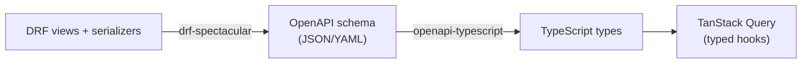

# Chapter 16 — Typed contracts

## TL;DR

- `drf-spectacular` generates an OpenAPI schema from your DRF views/serializers — a machine-readable description of every endpoint, automatically, not hand-maintained.
- `openapi-typescript` turns that schema into TypeScript types, which TanStack Query (or any typed fetch layer) can use — so a backend field rename becomes a compile error on the frontend, not a runtime surprise.
- The alternative some teams reach for is tRPC — but that's a JS-only approach (client and server both TypeScript); it doesn't apply here since the server is Django/Python. OpenAPI generation is the cross-language equivalent.

## The mental model

Ok, we've built a real API — models, serializers, auth, permissions, pagination, error shapes (chapters 6–15). Every one of those pieces exists in Django's world; your React app knows nothing about them except by convention and hope. This chapter closes that gap: generate a schema from the actual Django code, then generate TypeScript types from that schema, so "the frontend's idea of the API" and "the API's actual shape" can't silently drift apart.



## If you know JS: openapi-typescript / tRPC

**tRPC** gets you end-to-end types without any schema generation step — but only because both ends are TypeScript, sharing types directly through imports. That doesn't apply here: the server is Python. The nearest equivalent for a non-TS backend is generating a schema the backend can produce and the frontend can consume — which is exactly what OpenAPI does.

```ts
// openapi-typescript generates something like this from the schema:
export interface paths {
  "/api/greetings/": {
    get: {
      responses: {
        200: {
          content: {
            "application/json": {
              count: number;
              next: string | null;
              previous: string | null;
              results: components["schemas"]["Greeting"][];
            };
          };
        };
      };
    };
  };
}

export interface components {
  schemas: {
    Greeting: {
      id: number;
      message: string;
      category: string | null;
      created_at: string;
    };
  };
}
```

```ts
// Used with TanStack Query + openapi-fetch (or similar typed client)
const { data } = useQuery({
  queryKey: ["greetings"],
  queryFn: () => client.GET("/api/greetings/"),
});
// data.results[0].message — typed, autocompleted, and a compile error if the
// backend renames or removes the field.
```

| Approach | Requires | Works with Django? |
|---|---|---|
| tRPC | TypeScript on both ends | No — server is Python |
| `openapi-typescript` + a typed fetch client | An OpenAPI schema, generated from *any* backend | Yes — this is the one to use |
| Hand-written types, kept in sync manually | Discipline, and it will eventually drift | Works until it doesn't |

## The Django way

**Generating the schema** — [`examples/config/settings.py`](../examples/config/settings.py) wires up `drf-spectacular`:

```python
REST_FRAMEWORK = {
    ...
    "DEFAULT_SCHEMA_CLASS": "drf_spectacular.openapi.AutoSchema",
}

SPECTACULAR_SETTINGS = {
    "TITLE": "Django for JS Devs — example API",
    "DESCRIPTION": "The example project used throughout the guide.",
    "VERSION": "1.0.0",
}
```

And [`examples/config/urls.py`](../examples/config/urls.py) exposes it:

```python
path("api/schema/", SpectacularAPIView.as_view(), name="schema"),
path("api/docs/", SpectacularSwaggerView.as_view(url_name="schema"), name="swagger-ui"),
```

`GET /api/schema/?format=json` returns the OpenAPI document itself — [`examples/greetings/tests.py`](../examples/greetings/tests.py)'s `test_openapi_schema_is_served` confirms `/api/greetings/` shows up as a documented path. `GET /api/docs/` renders an interactive Swagger UI page for browsing the same schema by hand, without any frontend tooling — handy for checking what got generated.

**Turning that into TypeScript** happens on the frontend side, outside `examples/` (which is Django-only):

```bash
npx openapi-typescript http://localhost:8000/api/schema/?format=json -o src/api-types.ts
```

Run that whenever the backend's API shape changes, check the generated file into the frontend repo (or regenerate it in CI), and the type errors it produces are your early warning that a frontend assumption no longer matches the real API.

**Where DRF's auto-detection needs help.** You may have noticed `drf-spectacular` warns about `ping` and `whoami` in `examples/` ("unable to guess serializer") — they're plain function-based views with no `serializer_class`, so drf-spectacular can't infer their response shape automatically. For an endpoint like that, you'd add an explicit `@extend_schema` decorator describing the response — not done in `examples/` yet, since both are simple enough that the generated (empty) schema entry doesn't cause real harm, but worth knowing the escape hatch exists once a hand-written endpoint's shape actually matters to consumers.

## Gotchas for JS devs

- The schema is only as accurate as what DRF can infer. `ModelSerializer`-backed `ViewSet`s (like `GreetingViewSet`) generate an accurate schema automatically; plain function-based views often need `@extend_schema` hints, as above.
- Regenerating TypeScript types isn't automatic — it's a step you (or CI) run deliberately. Nothing fails silently if you forget, but the whole point is lost if the generated types are stale, so wiring it into a build/CI step is worth doing once the frontend depends on it.
- This is fundamentally different from tRPC's promise — tRPC gives you *live*, always-in-sync types because there's one shared TypeScript codebase. OpenAPI generation gives you a snapshot that's accurate as of when you last ran the generator.

## Check yourself

1. Why doesn't tRPC apply to a Django backend, even though it solves the same underlying problem (type-safe frontend/backend contracts)?

   <details><summary>Answer</summary>tRPC works by sharing actual TypeScript types between a TypeScript client and a TypeScript server. Django's server code is Python, so there's nothing to share directly — you need an intermediate, language-agnostic contract (OpenAPI) instead.</details>

2. Why did `drf-spectacular` warn about `ping` and `whoami` but not about `GreetingViewSet`?

   <details><summary>Answer</summary><code>GreetingViewSet</code> has a <code>serializer_class</code> DRF can inspect to infer the request/response shape automatically. <code>ping</code> and <code>whoami</code> are plain function-based views with no serializer, so drf-spectacular has nothing to introspect and falls back to an empty/best-guess schema entry unless you add an explicit <code>@extend_schema</code> hint.</details>

## Go deeper (when you need it)

- [drf-spectacular documentation](https://drf-spectacular.readthedocs.io/)
- [openapi-typescript documentation](https://openapi-ts.dev/)
- [tRPC documentation](https://trpc.io/) (for context on the TS-only alternative)

## Further reading & credits

- [drf-spectacular](https://drf-spectacular.readthedocs.io/) — Tim Schilling & contributors, BSD-3-Clause.
- [openapi-typescript](https://openapi-ts.dev/) — MIT.
- [OpenAPI Specification](https://www.openapis.org/) — Linux Foundation, Apache-2.0.
