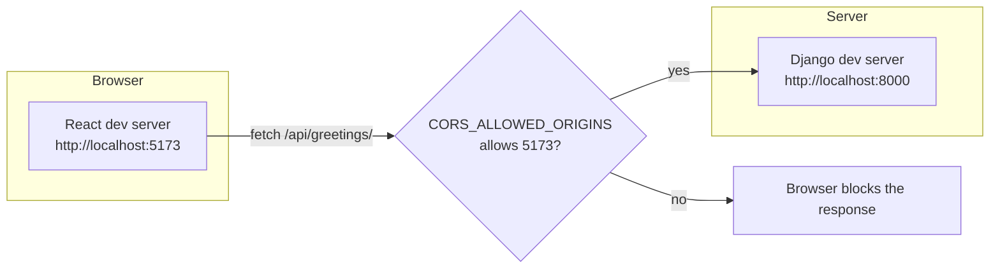

# Chapter 17 — Dev setup: React ↔ Django

## TL;DR

- Running React (Vite, port 5173) and Django (port 8000) locally means two origins — the browser will block cross-origin requests unless the API explicitly allows them, via CORS.
- `django-cors-headers` is the standard way to allow specific origins; it's a few lines of settings, not custom middleware you write yourself.
- Moving from mocked API data (MSW) to the real Django API is a config change on the frontend, not a rewrite — if your mocks matched the real response shape.

## The mental model

Ok, we've built a real API — auth (ch.12), permissions (ch.13), pagination/filtering (ch.14). Now let's connect it to an actual React dev server and see what breaks first. Spoiler: it's CORS.



Two different ports on `localhost` count as two different origins as far as the browser's same-origin policy is concerned — this isn't Django-specific, it's how every browser treats cross-origin requests, JS backend or not.

## If you know JS: Vite config, MSW

**CORS** is the same concept whether your backend is Express or Django — allow specific origins to make cross-origin requests:

```js
// Express (cors package)
app.use(cors({ origin: "http://localhost:5173" }));
```

```python
# examples/config/settings.py
CORS_ALLOWED_ORIGINS = os.environ.get(
    "CORS_ALLOWED_ORIGINS", "http://localhost:5173"
).split(",")
```

```python
MIDDLEWARE = [
    "django.middleware.security.SecurityMiddleware",
    "corsheaders.middleware.CorsMiddleware",   # must sit early in the list
    ...
]
```

| Concern | JS tooling | Django |
|---|---|---|
| Allow cross-origin requests | `cors` package (Express) | `django-cors-headers` |
| Avoid CORS entirely in dev | Vite dev server proxy (`vite.config.js`) | Same option works — proxy `/api` to Django instead of allowing CORS |
| Mock the API before it's ready | MSW (Mock Service Worker) | Same — MSW doesn't care what the real backend is |

**A Vite proxy** avoids the CORS question in dev entirely, by making requests look same-origin to the browser:

```js
// vite.config.js
export default {
  server: {
    proxy: {
      "/api": "http://localhost:8000",
    },
  },
};
```

With this, your React code calls `fetch("/api/greetings/")` as if it were same-origin — Vite forwards it to Django behind the scenes. This is often simpler than configuring CORS for local dev, though production still needs a real CORS or same-origin setup depending on how you deploy (chapter 24).

## The Django way

**Enable CORS for your frontend's origin** — already done in [`examples/config/settings.py`](../examples/config/settings.py):

```python
CORS_ALLOWED_ORIGINS = os.environ.get(
    "CORS_ALLOWED_ORIGINS", "http://localhost:5173"
).split(",")
```

Set via `.env` (see [`examples/.env.example`](../examples/.env.example)) so it's easy to change per environment without touching code — same pattern as every other environment-specific value since chapter 9.

`CorsMiddleware` must be placed near the top of `MIDDLEWARE`, before `CommonMiddleware` — it needs to add CORS headers to every response, including ones that get rejected/redirected further down the pipeline (chapter 4).

**From the React side**, once either CORS or a proxy is in place, calling the API is just `fetch`/`axios`/TanStack Query pointed at the right base URL:

```js
const res = await fetch("http://localhost:8000/api/greetings/", {
  headers: { Authorization: `Token ${token}` },  // chapter 12
});
const { results } = await res.json();  // chapter 14 — paginated envelope
```

**Moving from MSW mocks to the real API.** If your MSW handlers were written against the same response shape the real API actually returns (the paginated envelope from chapter 14, the auth header from chapter 12), switching over is just removing the MSW handler registration — no changes needed in the component code that calls `fetch`/TanStack Query. This is the payoff of getting the shapes right early, and part of why chapter 16 (typed contracts) matters once this project needs to scale past hand-written mocks.

## Gotchas for JS devs

- `CORS_ALLOWED_ORIGINS` is an allow-list of exact origins (scheme + host + port) — `http://localhost:5173` and `http://127.0.0.1:5173` are different origins to a browser, and to this list.
- If you're sending cookies/session auth cross-origin (rather than a token in a header), you also need `CORS_ALLOW_CREDENTIALS = True` and the frontend fetch needs `credentials: "include"` — token auth (chapter 12) avoids this entirely, which is one more reason it's the simpler default for a decoupled SPA.
- A CORS error in the browser console almost always means the *browser* blocked a response it already received — the request often did reach Django and got a real response; the browser just refused to hand it to your JS. Check the Network tab's response, not just the console error, when debugging.

## Check yourself

1. Why do `http://localhost:5173` and `http://localhost:8000` count as different origins even though the hostname is the same?

   <details><summary>Answer</summary>The port is part of the origin. Same-origin requires matching scheme, host, <i>and</i> port — different ports mean different origins.</details>

2. What are the two approaches this chapter covers for letting React (port 5173) call Django (port 8000) in dev, and which one avoids configuring CORS at all?

   <details><summary>Answer</summary><code>django-cors-headers</code> (allow the origin explicitly) or a Vite dev-server proxy (make the request look same-origin to the browser). The Vite proxy avoids configuring CORS entirely, since the browser never sees a cross-origin request.</details>

## Go deeper (when you need it)

- [django-cors-headers documentation](https://github.com/adamchainz/django-cors-headers)
- [Vite docs — server proxy](https://vite.dev/config/server-options.html#server-proxy)
- [MSW documentation](https://mswjs.io/)

## Further reading & credits

- [django-cors-headers](https://github.com/adamchainz/django-cors-headers) — Adam Johnson & contributors, MIT.
- [Vite documentation](https://vite.dev/) — VoidZero, MIT.
- [MSW documentation](https://mswjs.io/) — MIT.
