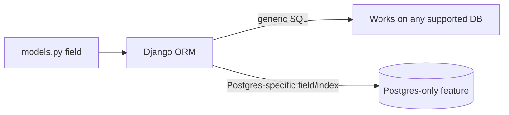

# Chapter 18 — Postgres with Django

## TL;DR

- Django talks to Postgres through the ORM by default, but Postgres-specific features (like `JSONField`, full-text search, array fields) are available when you need them.
- `JSONField` maps directly to Postgres's native `jsonb` column — closest JS comparison is a Prisma `Json` field or just storing arbitrary JSON in a document-ish way, but backed by a real relational column with indexing options.
- Indexes are declared on the model (`db_index=True` or `Meta.indexes`) — same idea as a Prisma `@@index`, generated into a migration (chapter 7) rather than written as raw SQL.

## The mental model

Ok, `examples/` has been running on Postgres since chapter 0, connecting through the plain relational fields covered in chapter 6 — `CharField`, `ForeignKey`, `DateTimeField`. This chapter is about the Postgres-specific features Django exposes once "just a relational table" isn't enough.



Most of what you've written so far (`CharField`, `ForeignKey`, `DateTimeField`) would also work unmodified against MySQL or SQLite (which is exactly how `settings_test.py`, chapter 9, swaps to SQLite for fast tests). The features in this chapter are Postgres-specific and wouldn't portray the same way on another database.

## If you know JS: Prisma + Postgres

| Postgres feature | Prisma | Django |
|---|---|---|
| JSON column | `Json` field type | `models.JSONField()` |
| Array column | Not modeled directly — often JSON instead | `django.contrib.postgres.fields.ArrayField` |
| Full-text search | Raw SQL or a search extension | `django.contrib.postgres.search` (`SearchVector`, etc.) |
| Index | `@@index([field])` | `models.Index(fields=["field"])` in `Meta.indexes`, or `db_index=True` on a field |

Prisma is intentionally database-agnostic in its schema language, with a few Postgres-specific escape hatches. Django's ORM is the same shape — generic fields that work everywhere, plus `django.contrib.postgres` specifically for the Postgres-only features.

## The Django way

**`JSONField`** stores arbitrary JSON in a native `jsonb` column — useful for data that doesn't fit a fixed relational shape, like a flexible "extra metadata" field:

```python
from django.db import models

class Greeting(models.Model):
    ...
    metadata = models.JSONField(default=dict, blank=True)
```

```python
greeting.metadata = {"locale": "en-IE", "tags": ["formal", "morning"]}
greeting.save()

Greeting.objects.filter(metadata__locale="en-IE")  # query into the JSON
```

That last line — filtering *into* the JSON structure — is genuinely a Postgres `jsonb` capability Django exposes through the ORM's lookup syntax (chapter 6), not something that works the same way on every database backend.

**Indexes**, declared on the model rather than written as raw SQL migration:

```python
class Greeting(models.Model):
    message = models.CharField(max_length=200, db_index=True)

    class Meta:
        indexes = [
            models.Index(fields=["created_at"]),
        ]
```

Running `makemigrations` (chapter 7) after adding either of these picks up the change and generates the `CREATE INDEX` for you — same review-before-apply flow as any other schema change.

> ⚠️ Verify: `examples/` doesn't currently use `JSONField` or a custom index — this chapter describes the feature and its Django API accurately against the docs, but hasn't been exercised against a running example in this codebase yet. If you add one, verify the generated migration and query behavior against your actual Postgres version before relying on it.

## Gotchas for JS devs

- `JSONField` on SQLite (which `settings_test.py`'s fast test suite uses, chapter 9) works differently under the hood than on Postgres — basic storage and retrieval behave the same, but Postgres-specific `jsonb` querying operators may not translate identically. Test JSON-querying logic against real Postgres, not just the fast SQLite test path.
- Postgres-specific fields (`ArrayField`, full-text search) genuinely lock you into Postgres — there's no portable fallback the way `JSONField` degrades gracefully to SQLite's JSON support. That's a deliberate trade-off `examples/` already made by picking Postgres as this guide's database (chapter 0), not something to worry about unless you're targeting multiple database backends.
- An index declared in `Meta.indexes` only takes effect after you run and apply the migration — same "two steps, not automatic" behavior as every other schema change (chapter 7).

## Check yourself

1. Why does filtering with `metadata__locale="en-IE"` work as a database-level query, rather than fetching every row and filtering in Python?

   <details><summary>Answer</summary>Postgres's <code>jsonb</code> column type supports querying into JSON structure at the SQL level, and Django's ORM lookup syntax (<code>__</code>) exposes that capability directly — the filtering happens in Postgres, not in Python after fetching.</details>

2. If you switch a test suite to SQLite (as `settings_test.py` does) but a model uses `ArrayField`, what would you expect to happen?

   <details><summary>Answer</summary>It would fail — <code>ArrayField</code> is Postgres-specific with no SQLite equivalent, unlike <code>JSONField</code> which has reasonable behavior on both. Postgres-only fields need either a Postgres-backed test database, or must be avoided in code paths the fast SQLite suite exercises.</details>

## Go deeper (when you need it)

- [Django docs — PostgreSQL-specific model fields](https://docs.djangoproject.com/en/5.2/ref/contrib/postgres/fields/)
- [Django docs — full-text search](https://docs.djangoproject.com/en/5.2/ref/contrib/postgres/search/)
- [Django docs — `Meta.indexes`](https://docs.djangoproject.com/en/5.2/ref/models/indexes/)

## Further reading & credits

- [Django docs — PostgreSQL specific features](https://docs.djangoproject.com/en/5.2/ref/contrib/postgres/) — Django Software Foundation, BSD-3-Clause.
- [PostgreSQL JSON types documentation](https://www.postgresql.org/docs/current/datatype-json.html) — PostgreSQL Global Development Group, PostgreSQL License.
