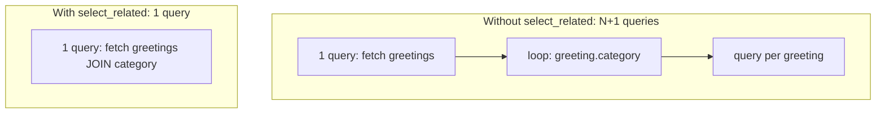

# Chapter 19 — N+1 queries

## TL;DR

- Accessing a related object per row in a loop (`greeting.category.name` for each greeting) triggers one query *per row* unless you tell Django to fetch it upfront — the classic N+1 problem.
- `select_related` (for `ForeignKey`/`OneToOne`) does this with a SQL JOIN; `prefetch_related` (for reverse FKs/many-to-many) does it with a second, separate query.
- Direct equivalent to Prisma's `include` — same problem, same fix, different syntax.

## The mental model

Ok, we've had a `category` relation on `Greeting` since chapter 6, and `GreetingSerializer` has been reading `greeting.category.name` for every greeting in a list since chapter 11. That's exactly the shape of query that can silently multiply — let's see why, and how it's already being avoided in `examples/`.



For 5 greetings, the naive version runs 6 queries (1 + 5). For 500 greetings, it's 501. The query count grows with the data — which is exactly the kind of bug that's invisible in dev with 5 rows and painful in production with 50,000.

## If you know JS: Prisma `include`

```ts
// Prisma — without include: N+1 if you access category per row afterward
const greetings = await prisma.greeting.findMany();
// greetings.forEach(g => g.category...) -- category wasn't fetched, another query per access

// Prisma — with include: one query, JOINed
const greetings = await prisma.greeting.findMany({
  include: { category: true },
});
```

```python
# Django — without select_related: N+1
greetings = Greeting.objects.all()
for g in greetings:
    g.category.name  # separate query, every single time, per greeting

# Django — with select_related: one query, JOINed
greetings = Greeting.objects.select_related("category").all()
for g in greetings:
    g.category.name  # already fetched — no extra query
```

Same problem, same fix, different spelling. `include` and `select_related` both tell the ORM "fetch this relation in the same query," rather than lazily fetching it the moment you access it.

| Prisma | Django |
|---|---|
| `include: { category: true }` | `.select_related("category")` — for `ForeignKey`/`OneToOne` (JOIN) |
| `include: { greetings: true }` (reverse) | `.prefetch_related("greetings")` — for reverse FK / many-to-many (separate query) |

## The Django way

[`examples/greetings/views.py`](../examples/greetings/views.py)'s `GreetingViewSet` already does this:

```python
class GreetingViewSet(viewsets.ModelViewSet):
    queryset = Greeting.objects.select_related("category").all()
```

Without `select_related("category")`, `GreetingSerializer.category` (chapter 11's `SlugRelatedField`, which reads `category.name`) would trigger one extra query *per greeting* in the response — invisible with the 5 test rows in `examples/`, real once this were a production table.

[`examples/greetings/tests.py`](../examples/greetings/tests.py) makes the query count itself part of the test, using pytest-django's `django_assert_num_queries` fixture:

```python
@pytest.mark.django_db
def test_greetings_list_uses_select_related_to_avoid_n_plus_1(django_assert_num_queries):
    formal = GreetingCategory.objects.create(name="Formal")
    for i in range(5):
        Greeting.objects.create(message=f"Greeting {i}", category=formal)
    client = APIClient()

    with django_assert_num_queries(2):  # 1 for the page, 1 for pagination's count
        response = client.get("/api/greetings/")
```

This is worth doing for any endpoint where an N+1 regression would be easy to introduce silently — it turns "the query count grows with the number of rows" into a test failure instead of a production incident.

**`prefetch_related` for the reverse direction.** `select_related` only works for `ForeignKey`/`OneToOne`, because those map cleanly onto a SQL JOIN. Fetching every `Greeting` for a `GreetingCategory` (the reverse direction, or any many-to-many) can't be a single JOIN without risking a huge result set — Django instead runs one extra query for *all* the related rows at once, then matches them up in Python:

```python
categories = GreetingCategory.objects.prefetch_related("greetings").all()
for c in categories:
    c.greetings.all()  # already fetched, no extra query per category
```

Not used in `examples/` yet, since nothing currently loops over categories and their greetings — but the pattern is the direct counterpart to `select_related` for the direction it doesn't cover.

## Gotchas for JS devs

- `select_related`/`prefetch_related` only help if you also *access* the relation afterward — adding them "just in case" costs nothing at the query level if unused, but they don't optimize anything you don't actually read.
- Debug Toolbar or Django's `connection.queries` (in tests, via `django_assert_num_queries` as above) are how you actually *see* N+1 happening — it doesn't throw an error or a warning by default, it just quietly runs more queries than you'd expect.
- Choosing the wrong one (`select_related` on a reverse/many-to-many relation) raises an error at query time — Django won't silently do the wrong thing, but you do need to know which relation type you're dealing with.

## Check yourself

1. Why does `select_related("category")` fix the N+1 problem for `GreetingSerializer`, but wouldn't work for prefetching `category.greetings.all()` from the category side?

   <details><summary>Answer</summary><code>select_related</code> only works for <code>ForeignKey</code>/<code>OneToOne</code>, which map to a single-row JOIN. The reverse direction (one category → many greetings) can't be flattened into a single JOIN row per category, so it needs <code>prefetch_related</code> instead (a second query, matched up in Python).</details>

2. What does `django_assert_num_queries(2)` actually verify in the test above, and why does it matter that the count is fixed rather than "roughly right"?

   <details><summary>Answer</summary>It asserts the block runs exactly 2 queries. The point of pinning an exact number is that an N+1 regression would change that count as soon as more rows exist — a fixed assertion catches the regression immediately, rather than only showing up as slowness later with real data.</details>

## Go deeper (when you need it)

- [Django docs — `select_related`](https://docs.djangoproject.com/en/5.2/ref/models/querysets/#select-related)
- [Django docs — `prefetch_related`](https://docs.djangoproject.com/en/5.2/ref/models/querysets/#prefetch-related)
- [pytest-django docs — `django_assert_num_queries`](https://pytest-django.readthedocs.io/en/latest/helpers.html#django-assert-num-queries)

## Further reading & credits

- [Django docs — QuerySet API](https://docs.djangoproject.com/en/5.2/ref/models/querysets/) — Django Software Foundation, BSD-3-Clause.
- [Prisma — relation queries](https://www.prisma.io/docs/orm/prisma-client/queries/relation-queries) — Prisma, Apache-2.0.
