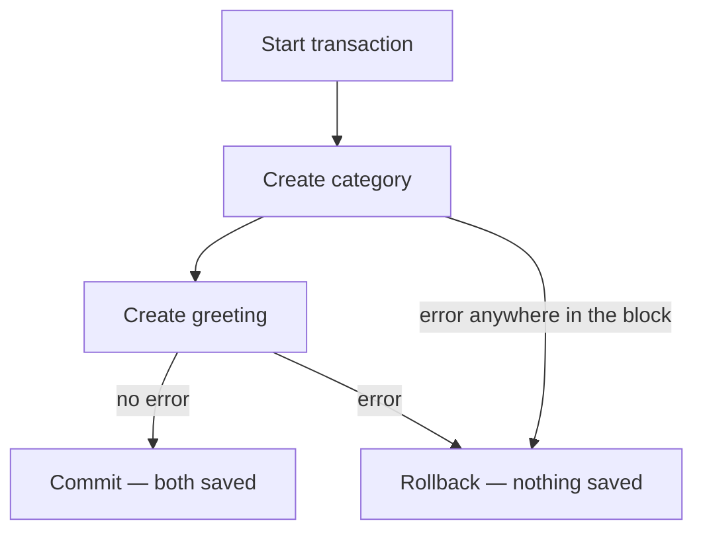

# Chapter 20 — Transactions

## TL;DR

- `transaction.atomic` wraps a block of code so that either everything commits, or nothing does — same job as `prisma.$transaction`.
- Use it whenever you're writing to more than one table (or making more than one write) that only makes sense together.
- It works as a decorator on a function or as a `with` block — both roll back automatically if an exception is raised inside.

## The mental model

Ok, we've been creating one `Greeting` at a time. But what about an operation that needs two related writes to succeed *together* — like creating a brand-new category and a greeting in it in one step? If the second write fails, you don't want an orphaned category left behind. That's what a transaction guarantees.



## If you know JS: `prisma.$transaction`

```ts
// Prisma
await prisma.$transaction(async (tx) => {
  const category = await tx.greetingCategory.create({ data: { name: categoryName } });
  if (!message.trim()) throw new Error("message cannot be blank.");
  return tx.greeting.create({ data: { message, categoryId: category.id } });
});
// if the function throws, Prisma rolls back both writes
```

```python
# examples/greetings/services.py
@transaction.atomic
def create_greeting_with_new_category(message: str, category_name: str) -> Greeting:
    category = GreetingCategory.objects.create(name=category_name)

    if not message.strip():
        raise MessageRequiredError("message cannot be blank.")

    return Greeting.objects.create(message=message, category=category)
```

Same shape: wrap the whole operation, and if anything inside raises, everything written so far in that block is undone. Django's version doesn't need a special transaction object (`tx` in the Prisma example) — regular model calls inside an `atomic` block automatically participate in it.

| Prisma | Django |
|---|---|
| `prisma.$transaction(async (tx) => {...})` | `@transaction.atomic` decorator, or `with transaction.atomic():` |
| Operations use `tx.model.create(...)` | Operations use the model directly — `Model.objects.create(...)` — no special transaction handle needed |
| Any thrown error rolls back | Any raised exception rolls back |

## The Django way

[`examples/greetings/services.py`](../examples/greetings/services.py) has the real example above, exercised by two tests in [`examples/greetings/tests.py`](../examples/greetings/tests.py):

- `test_create_greeting_with_new_category_commits_both` — happy path, both rows exist afterward.
- `test_create_greeting_with_new_category_rolls_back_on_error` — the category insert runs, *then* the error is raised, and the test confirms the category doesn't exist afterward either. This is the part that actually proves atomicity: without `@transaction.atomic`, the category would be left behind even though the overall operation "failed."

**As a context manager**, when you don't want to wrap an entire function:

```python
def some_view(request):
    # ... some non-transactional logic ...
    with transaction.atomic():
        category = GreetingCategory.objects.create(name=request.data["name"])
        Greeting.objects.create(message=request.data["message"], category=category)
    # ... more logic, outside the transaction ...
```

Both forms behave the same way — pick whichever fits how much of the function needs to be atomic.

## Gotchas for JS devs

- Nothing about a regular Django view is transactional by default — each `.save()`/`.create()` call commits on its own unless it's inside an `atomic()` block. This is different from frameworks that wrap every request in a transaction automatically; you opt in explicitly, function by function.
- Raising any exception inside the block triggers the rollback — you don't need a special "transaction error" type. `MessageRequiredError` here is a plain `Exception` subclass; Django's `atomic()` reacts to any exception escaping the block.
- Nested `atomic()` blocks use savepoints, not fully independent transactions — an inner block failing doesn't necessarily roll back the outer one by itself, depending on how you structure error handling. Keep transactional functions focused and shallow rather than nesting several layers of `atomic()`.

## Check yourself

1. In `create_greeting_with_new_category`, why does `test_create_greeting_with_new_category_rolls_back_on_error` check that the category doesn't exist, even though the category insert clearly ran before the error?

   <details><summary>Answer</summary>Because <code>@transaction.atomic</code> means nothing in the function is actually committed until the function returns without raising. The category insert running doesn't mean it's saved — the whole block rolls back together when the exception propagates.</details>

2. What's the Django equivalent of Prisma's `tx` transaction handle inside `$transaction(async (tx) => {...})`?

   <details><summary>Answer</summary>There isn't one — inside a Django <code>atomic()</code> block, you call model methods directly (<code>Model.objects.create(...)</code>) and they automatically participate in the enclosing transaction, without needing a special handle passed around.</details>

## Go deeper (when you need it)

- [Django docs — transactions](https://docs.djangoproject.com/en/5.2/topics/db/transactions/)
- [Prisma — transactions](https://www.prisma.io/docs/orm/prisma-client/queries/transactions)

## Further reading & credits

- [Django docs — transactions](https://docs.djangoproject.com/en/5.2/topics/db/transactions/) — Django Software Foundation, BSD-3-Clause.
- [Prisma transactions docs](https://www.prisma.io/docs/orm/prisma-client/queries/transactions) — Prisma, Apache-2.0.
