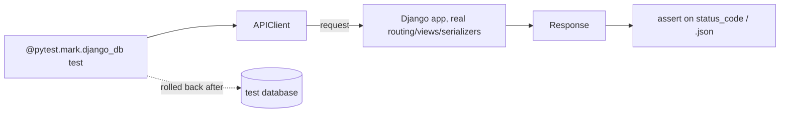

# Chapter 21 — Testing

## TL;DR

- `pytest-django` + DRF's `APIClient` is the same shape as Vitest + Supertest — spin up requests against your app, assert on the response.
- `@pytest.mark.django_db` gives each test a clean, rolled-back database transaction — no manual setup/teardown of test data.
- Every test referenced throughout this guide already lives in [`examples/greetings/tests.py`](../examples/greetings/tests.py) — this chapter names the patterns you've already seen in every previous chapter.

## The mental model

Ok, by now nearly every chapter has pointed at a passing test in `examples/greetings/tests.py` as proof a feature works. This chapter is the one naming what's actually going on in that file — the tools, the fixtures, and the patterns repeated in almost all 18 tests written so far.



## If you know JS: Vitest + Supertest

```ts
// Vitest + Supertest
test("creates a greeting", async () => {
  const res = await request(app).post("/api/greetings").send({ message: "Hi" });
  expect(res.status).toBe(201);
});
```

```python
# examples/greetings/tests.py — same shape
@pytest.mark.django_db
def test_greetings_create_endpoint():
    staff = User.objects.create_user(username="staff", password="s3cret", is_staff=True)
    client = APIClient()
    client.force_authenticate(user=staff)

    response = client.post("/api/greetings/", {"message": "New greeting"})

    assert response.status_code == 201
```

| Vitest + Supertest | pytest-django + DRF |
|---|---|
| `request(app).post(...)` | `APIClient().post(...)` |
| `expect(res.status).toBe(201)` | `assert response.status_code == 201` |
| Test DB reset between tests — you set this up | `@pytest.mark.django_db` — one decorator, handled for you |
| Fixtures/factories for setup data | Plain model `.objects.create(...)` calls, or a factory library (below) |

The biggest structural difference: Supertest needs your Express `app` instance passed in explicitly. DRF's `APIClient` already knows how to route through your project because it's running inside Django's own test machinery — no app instance to wire up.

## The Django way

**`@pytest.mark.django_db`** is the one thing every database-touching test in `examples/` has in common — without it, any ORM call raises an error, since Django blocks database access in tests by default unless you opt in:

```python
@pytest.mark.django_db
def test_greeting_str():
    greeting = Greeting.objects.create(message="Hello from Django")
    assert str(greeting) == "Hello from Django"
```

Each test gets its own database transaction that's rolled back at the end — `test_greeting_category_relation` creating a category, and `test_create_greeting_with_new_category_rolls_back_on_error` creating one that then rolls back on purpose (chapter 20), don't interfere with each other even though both run against the same test database.

**`APIClient`**, DRF's test client, exercises the *real* routing/middleware/view/serializer stack — not mocked pieces:

```python
client = APIClient()
client.force_authenticate(user=staff)  # skip real login, just set request.user
response = client.get("/api/greetings/")
```

`force_authenticate` is the one deliberate shortcut — it sets `request.user` directly rather than requiring a real token exchange (chapter 12) for every test. `test_obtain_token_endpoint` still tests the real token-issuing flow explicitly, so the shortcut and the real flow are both covered where each matters.

**Testing without going through HTTP at all** — `services.py` (chapter 20) is tested by calling the function directly, no client involved:

```python
@pytest.mark.django_db
def test_create_greeting_with_new_category_commits_both():
    greeting = create_greeting_with_new_category("Good day", "Formal")
    assert greeting.category.name == "Formal"
```

Prefer this when you're testing business logic itself, not the HTTP layer around it — faster, and the failure points directly at the function under test rather than at a JSON response.

**Query-count assertions** — `django_assert_num_queries` (chapter 19) is a pytest-django fixture, not something you write yourself:

```python
with django_assert_num_queries(2):
    response = client.get("/api/greetings/")
```

## Gotchas for JS devs

- Forgetting `@pytest.mark.django_db` on a test that touches the ORM fails with a clear error, not a silent skip — easy to fix once you see the message, but easy to forget the first few times.
- `force_authenticate` bypasses real authentication entirely — it's for testing view logic, not for testing that auth itself works. Keep at least one test (like `test_obtain_token_endpoint`) exercising the real flow.
- There's no built-in factory library the way some JS projects reach for one (Fishery, or hand-written factories) — `examples/` just calls `.objects.create(...)` directly since the data needs are simple. `factory_boy` (mentioned in chapter 22 and the appendix) is the standard choice once tests need more complex or varied fixture data.

## Check yourself

1. What happens if you write a test that calls `Greeting.objects.create(...)` but forget `@pytest.mark.django_db`?

   <details><summary>Answer</summary>It fails immediately with an error explaining that database access isn't allowed — Django blocks DB access in tests unless a test explicitly opts in via that marker.</details>

2. Why does `test_create_greeting_with_new_category_commits_both` call `create_greeting_with_new_category(...)` directly instead of going through `APIClient`?

   <details><summary>Answer</summary>It's testing the business logic in <code>services.py</code> itself, not an HTTP endpoint — calling the function directly is faster and points failures straight at that function, rather than routing through the HTTP/serializer layer unnecessarily.</details>

## Go deeper (when you need it)

- [pytest-django documentation](https://pytest-django.readthedocs.io/)
- [DRF docs — testing](https://www.django-rest-framework.org/api-guide/testing/)
- [factory_boy documentation](https://factoryboy.readthedocs.io/)

## Further reading & credits

- [pytest-django documentation](https://pytest-django.readthedocs.io/) — pytest-dev, BSD-3-Clause.
- [DRF docs — testing](https://www.django-rest-framework.org/api-guide/testing/) — Encode OSS, BSD-3-Clause.
- [Supertest](https://github.com/ladjs/supertest) — MIT.
