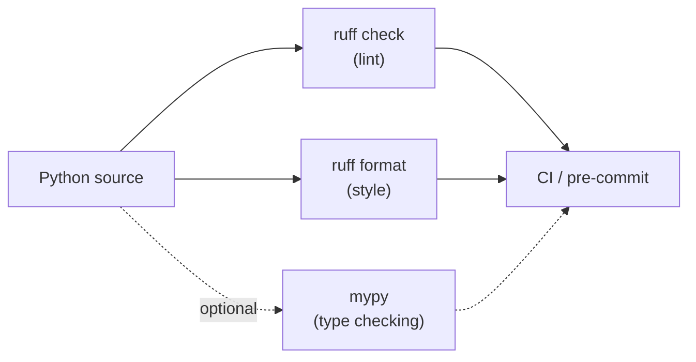

# Chapter 22 — Tooling

## TL;DR

- `ruff` covers both linting and formatting for Python — one fast tool, similar in spirit to Biome for JS, rather than ESLint + Prettier as two separate tools.
- `mypy` (or another type checker) is optional and separate from Django itself — type hints (chapter 1) aren't checked unless you run one.
- Pre-commit hooks wire these into your git workflow, the same role Husky plays in a JS project.

## The mental model

Ok, `examples/` has been running `ruff check` and `ruff format --check` in CI (chapter 1) since Phase 1 of this project's own history — every chapter's code changes have gone through it already. This chapter names what that tool actually is and where it sits relative to the JS tooling you already know.



## If you know JS: ESLint + Prettier, or Biome

| JS tooling | Python (this project) |
|---|---|
| ESLint (linting) | `ruff check` |
| Prettier (formatting) | `ruff format` |
| Biome (both, one fast tool) | `ruff` (both, one fast tool) — the closer comparison |
| `tsc --noEmit` (type checking) | `mypy` (optional, separate step) |
| Husky + lint-staged | `pre-commit` |

`ruff` is explicitly the better comparison to Biome than to the ESLint+Prettier pair — one binary, written in Rust, doing both jobs fast. [`examples/pyproject.toml`](../examples/pyproject.toml) configures both halves in one file:

```toml
[tool.ruff]
line-length = 100
target-version = "py312"
extend-exclude = ["**/migrations/*.py"]

[tool.ruff.lint]
select = ["E", "F", "I", "UP"]
```

## The Django way

**Running it** — exactly what CI already runs on every push:

```bash
uv run ruff check .          # lint
uv run ruff format --check . # verify formatting (CI mode — doesn't rewrite files)
uv run ruff format .         # actually reformat
```

**Why migrations are excluded from linting** (`extend-exclude` above) — they're generated by `makemigrations` (chapter 7), not hand-written, and Django's generated code sometimes produces long lines (e.g. a field's full `verbose_name` and constraints on one line) that aren't worth reformatting or fighting the linter over.

**Type checking is opt-in and separate.** Chapter 1 covered that Python type hints aren't enforced at runtime — `mypy` is the tool that actually checks them, similar to running `tsc --noEmit` as a standalone step rather than something the runtime does for you:

```bash
uv run mypy .
```

> ⚠️ Verify: `examples/` doesn't currently run `mypy` — the project's model/view/serializer code doesn't use type hints extensively yet, and adding strict type checking to a Django+DRF codebase (particularly around the ORM's dynamically-generated attributes) has enough nuance that it's called out here as a future addition rather than configured against unverified assumptions about what settings would actually pass cleanly.

**Pre-commit hooks**, wiring `ruff` into git the same way Husky wires ESLint/Prettier into a JS repo's commits:

```yaml
# .pre-commit-config.yaml (not present in examples/ yet)
repos:
  - repo: https://github.com/astral-sh/ruff-pre-commit
    rev: v0.16.9
    hooks:
      - id: ruff
      - id: ruff-format
```

Not added to `examples/` yet — CI already enforces both checks on every push, which covers the same guarantee at the cost of finding out at CI time rather than at commit time. Adding pre-commit is a reasonable next step once contributors start submitting PRs regularly.

## Gotchas for JS devs

- `ruff format --check` (used in CI) only *verifies* formatting and fails if anything's off — it doesn't rewrite files. `ruff format` (no `--check`) is the one that actually reformats, same distinction as `prettier --check` vs `prettier --write`.
- Ruff's lint rule categories (`E`, `F`, `I`, `UP` in the config above) map to different rule families — `E`/`F` are pyflakes/pycodestyle-derived, `I` is import sorting (like `eslint-plugin-import`'s sort rules), `UP` flags outdated syntax patterns Python has since improved on. You opt into rule categories explicitly; nothing is enabled by default beyond a small base set.
- Unlike TypeScript, where `tsc` is close to mandatory for any real project, `mypy` (or any Python type checker) is genuinely optional — plenty of production Django codebases run without one. Reach for it once you're finding real type-confusion bugs, not by default.

## Check yourself

1. Why is `ruff` compared to Biome rather than to the ESLint+Prettier combination?

   <details><summary>Answer</summary>Because it's one tool doing both linting and formatting, the same shape as Biome — versus ESLint and Prettier being two separate tools each doing one job.</details>

2. Why are migration files excluded from ruff's linting in `examples/pyproject.toml`?

   <details><summary>Answer</summary>They're auto-generated by <code>makemigrations</code>, not hand-written, and can contain long lines from field definitions that aren't worth reformatting or treating as a style violation.</details>

## Go deeper (when you need it)

- [Ruff documentation](https://docs.astral.sh/ruff/)
- [mypy documentation](https://mypy.readthedocs.io/)
- [pre-commit documentation](https://pre-commit.com/)

## Further reading & credits

- [Ruff documentation](https://docs.astral.sh/ruff/) — Astral, MIT.
- [mypy documentation](https://mypy.readthedocs.io/) — mypy contributors, MIT.
- [Biome](https://biomejs.dev/) — MIT.
