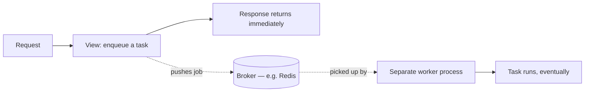

# Chapter 23 — Background tasks

## TL;DR

- Celery is Django's most established background job library — same role BullMQ plays in a Node stack: offload slow or delayed work out of the request/response cycle.
- Both need a broker (Redis is the common choice for either) and a separate worker process that isn't your web server.
- This chapter is conceptual — `examples/` doesn't have a Celery task yet, since adding one means adding a broker dependency (Redis) that the project doesn't otherwise need.

## The mental model

Ok, every endpoint so far in `examples/` responds synchronously — the request comes in, the view runs, the response goes out, all in one request/response cycle (chapter 4). Some work doesn't belong in that cycle: sending an email, generating a report, anything slow enough that making the client wait for it would be a bad experience. That's what a background task queue is for.



The request/response cycle never waits for the worker — that's the entire point. The web process and the worker process are two separate things, often even running on separate machines in production.

## If you know JS: BullMQ

```ts
// BullMQ
const queue = new Queue("emails", { connection: redis });
await queue.add("send-welcome", { userId: 42 });

// worker.ts — a separate process
new Worker("emails", async (job) => {
  await sendWelcomeEmail(job.data.userId);
}, { connection: redis });
```

```python
# Celery — conceptually identical shape
# tasks.py
@shared_task
def send_welcome_email(user_id):
    ...

# somewhere in a view
send_welcome_email.delay(user_id)  # enqueue, returns immediately

# a separate worker process picks it up:
# celery -A config worker
```

| BullMQ | Celery |
|---|---|
| `new Queue(...)` | A task decorated with `@shared_task` |
| `queue.add(...)` | `task_function.delay(...)` (or `.apply_async(...)` for more options) |
| A `Worker` instance, run as its own process | `celery -A config worker`, run as its own process |
| Redis (typical broker) | Redis or RabbitMQ (Celery supports either) |
| Scheduled/delayed jobs via BullMQ's repeat options | Celery Beat, a separate scheduler process, for periodic tasks |

The shapes translate almost one-to-one: define the unit of work, enqueue it instead of calling it directly, run a separate process that actually executes it.

## The Django way

**Defining a task** — conventionally in a `tasks.py` file per app:

```python
# greetings/tasks.py (not present in examples/ yet)
from celery import shared_task

@shared_task
def log_greeting_created(greeting_id):
    greeting = Greeting.objects.get(id=greeting_id)
    print(f"Greeting created: {greeting.message}")
```

**Enqueuing it** from a view or serializer, instead of calling it directly:

```python
def perform_create(self, serializer):
    greeting = serializer.save()
    log_greeting_created.delay(greeting.id)
```

Passing `greeting.id` rather than the `greeting` object itself is deliberate — the worker runs in a separate process and re-fetches the object fresh from the database, since a Celery task's arguments have to be serializable (typically JSON), and a model instance isn't.

**Running the worker** is a separate command, not something `runserver` does for you:

```bash
celery -A config worker --loglevel=info
```

> ⚠️ Verify: `examples/` doesn't include Celery or a Redis broker — adding either means introducing new infrastructure (a broker service, likely another `docker-compose.yml` entry) that the project doesn't otherwise need. This chapter's code samples describe Celery's actual API accurately against its docs, but haven't been run against a working task in this codebase. Treat the shape as correct and the specifics as worth confirming against the current Celery docs before depending on them in a real project.

## Gotchas for JS devs

- A Celery task's arguments must be serializable — you can't pass a Django model instance directly (unlike calling a normal Python function). Pass an ID and re-fetch inside the task, as above.
- Celery needs a broker (Redis/RabbitMQ) running, same as BullMQ needs Redis — it's not an in-process queue. `docker-compose.yml` (chapter 0) would need a new service for this.
- `.delay()` is fire-and-forget from the caller's perspective — the calling code doesn't wait for or receive the task's return value directly. Getting a result back requires a result backend (another piece of infrastructure) and polling/waiting for it, which most use cases don't actually need.

## Check yourself

1. Why does `log_greeting_created.delay(greeting.id)` pass an ID rather than the `greeting` object itself?

   <details><summary>Answer</summary>Celery task arguments must be serializable (typically to JSON) to cross the process boundary to the worker — a Django model instance isn't serializable that way. The task re-fetches the object fresh, by ID, inside the worker process.</details>

2. What two separate processes does a Celery-based feature require, beyond the Django web process itself?

   <details><summary>Answer</summary>A broker (Redis or RabbitMQ) and a Celery worker process — and, for periodic/scheduled tasks specifically, also Celery Beat as a third.</details>

## Go deeper (when you need it)

- [Celery documentation](https://docs.celeryq.dev/)
- [BullMQ documentation](https://docs.bullmq.io/)

## Further reading & credits

- [Celery documentation](https://docs.celeryq.dev/) — Celery contributors, BSD-3-Clause.
- [BullMQ documentation](https://docs.bullmq.io/) — MIT.
