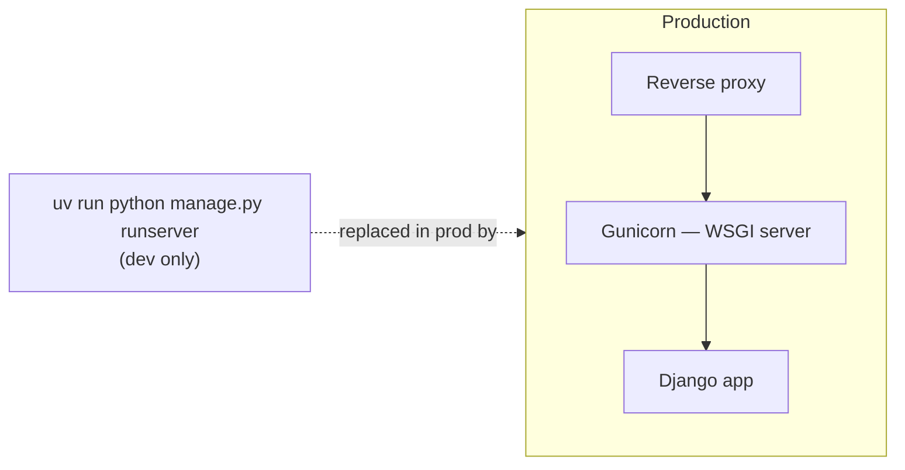

# Chapter 24 — Deploy

## TL;DR

- Django's `runserver` (used since chapter 0) is dev-only — production runs through a WSGI/ASGI server like Gunicorn, similar to running a Node app through PM2 instead of `node index.js` directly.
- The same `config/wsgi.py`/`asgi.py` entry points from chapter 4 are what a production server actually points at.
- Docker is the natural fit here — `examples/` already uses it for Postgres (chapter 0); production packages the Django app itself into a container too.

## The mental model

Ok, `runserver` has been running the whole example project since chapter 0 — but Django's own docs are explicit that it's not built for production traffic. This chapter is about what actually runs in its place.



## If you know JS: Node server + PM2

| Node | Django |
|---|---|
| `node index.js` (dev) | `manage.py runserver` (dev) |
| PM2 / a process manager, running the app in production | Gunicorn (or Uvicorn for async), running the app in production |
| A reverse proxy (Nginx) in front, handling static files/TLS | Same — Nginx (or similar) in front of Gunicorn |
| `pm2 start index.js -i 4` (multiple processes) | `gunicorn config.wsgi -w 4` (multiple worker processes) |

The parallel is close: neither Node's bare `http.createServer` nor Django's `runserver` is meant to face real traffic directly — both need a proper process manager/application server in front, and typically a reverse proxy in front of *that* for static files, TLS termination, and load balancing.

## The Django way

**Gunicorn**, pointed at the WSGI entry point that's existed since chapter 4:

```bash
uv run gunicorn config.wsgi:application --bind 0.0.0.0:8000 --workers 4
```

`config.wsgi:application` is the exact file introduced in chapter 4 — Gunicorn imports it and calls the `application` object Django defines there. Nothing about your views, models, or serializers changes; only what's running the process does.

**For async views** (chapter 4 mentioned Django supports `async def` views), Uvicorn plus the ASGI entry point instead:

```bash
uv run uvicorn config.asgi:application --host 0.0.0.0 --port 8000 --workers 4
```

**Containerizing it** — `examples/` already has a `docker-compose.yml` for Postgres (chapter 0); a production setup adds the Django app itself as a service:

```dockerfile
# Dockerfile (not present in examples/ yet)
FROM python:3.12-slim
COPY --from=ghcr.io/astral-sh/uv:latest /uv /uvx /bin/
WORKDIR /app
COPY . .
RUN uv sync --frozen --no-dev
CMD ["uv", "run", "gunicorn", "config.wsgi:application", "--bind", "0.0.0.0:8000"]
```

> ⚠️ Verify: `examples/` doesn't include this `Dockerfile` or a production `docker-compose.yml` service for the app itself yet — it currently only containerizes Postgres for local dev (chapter 0). This chapter's Dockerfile shape is accurate against `uv`'s and Gunicorn's current documentation, but hasn't been built and run against this specific codebase. Confirm it builds cleanly against `examples/pyproject.toml` before relying on it.

**Environment differences that matter in production**, building on chapter 9:

- `DEBUG=False` — always, in production (chapter 9 already flagged why).
- `ALLOWED_HOSTS` set to your real domain(s), not the `localhost` default.
- `SECRET_KEY` from a real secret store, never the `django-insecure-...` fallback.
- Static files collected ahead of time via `manage.py collectstatic`, then served by Nginx or a CDN — not by Django itself, which doesn't serve static files efficiently in production.

## Gotchas for JS devs

- `runserver`'s own docs describe it as "not tested for security or performance" — treat this as a hard rule, not a suggestion, the same way you wouldn't ship a bare `http.createServer` without a process manager and reverse proxy in front.
- Multiple Gunicorn workers means multiple Python processes, each with their own memory — same operational consideration as running multiple PM2 instances; in-memory state (like a naive cache) won't be shared between them without an external store (Redis, etc.).
- WSGI and ASGI aren't interchangeable at the deploy level — pick the one matching how you wrote your views (chapter 4) and deploy with the matching server (Gunicorn for WSGI, Uvicorn/Daphne for ASGI).

## Check yourself

1. What does Gunicorn actually import and run from `config/wsgi.py`?

   <details><summary>Answer</summary>The <code>application</code> object defined in that file — the same WSGI entry point discussed in chapter 4, unchanged by which server process is running it.</details>

2. Why doesn't Django serve static files itself in production, even though `runserver` appears to during development?

   <details><summary>Answer</summary><code>runserver</code>'s static file serving is a development convenience, explicitly not built for production performance or security. Production setups collect static files (<code>collectstatic</code>) and serve them via Nginx or a CDN instead.</details>

## Go deeper (when you need it)

- [Django docs — deploying Django](https://docs.djangoproject.com/en/5.2/howto/deployment/)
- [Django docs — deployment checklist](https://docs.djangoproject.com/en/5.2/howto/deployment/checklist/)
- [Gunicorn documentation](https://docs.gunicorn.org/)

## Further reading & credits

- [Django docs — deployment](https://docs.djangoproject.com/en/5.2/howto/deployment/) — Django Software Foundation, BSD-3-Clause.
- [Gunicorn documentation](https://docs.gunicorn.org/) — MIT.
- [Uvicorn documentation](https://www.uvicorn.org/) — BSD-3-Clause.
