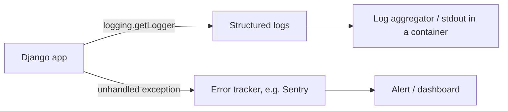

# Chapter 25 — Observability

## TL;DR

- Django's built-in logging is Python's standard `logging` module, configured through `LOGGING` in settings — same underlying tool as everywhere else in the Python ecosystem, not Django-specific.
- Error tracking (e.g. Sentry) plugs in with a few lines of setup, same shape as wiring Sentry into an Express or Next.js app.
- The `TimingMiddleware` from chapter 4 is a small, homegrown example of the kind of thing a proper observability setup replaces at scale.

## The mental model

Ok, `TimingMiddleware` (chapter 4) has been quietly adding an `X-Response-Time-Ms` header to every response since Part 2 — a tiny, hand-rolled piece of observability. This chapter is about the real tools that replace that once you actually need to know what's happening in production: structured logs, and error tracking that tells you the moment something breaks.



## If you know JS: same tools, different runtime

Error tracking and logging tools are mostly runtime-agnostic — the same vendors (Sentry, Datadog, etc.) support both ecosystems, so the biggest difference is the SDK, not the concept.

| Concern | Node/Express | Django |
|---|---|---|
| Structured logging | `winston` / `pino` | Python's built-in `logging`, configured via `LOGGING` in settings |
| Error tracking | `@sentry/node` | `sentry-sdk` (Django integration) |
| Request timing (homegrown) | Express middleware | `TimingMiddleware` (chapter 4) |
| APM / tracing | Datadog, New Relic, etc. | Same vendors — Python SDKs exist for all of them |

## The Django way

**Logging**, configured once in settings — this is the standard library's `logging` module, the same one every Python project uses, not something Django invented:

```python
# config/settings.py (not present in examples/ yet)
LOGGING = {
    "version": 1,
    "disable_existing_loggers": False,
    "handlers": {
        "console": {"class": "logging.StreamHandler"},
    },
    "root": {"handlers": ["console"], "level": "INFO"},
}
```

Then, anywhere in the codebase:

```python
import logging
logger = logging.getLogger(__name__)

logger.info("Greeting created", extra={"greeting_id": greeting.id})
```

**Error tracking with Sentry** — the setup is genuinely a few lines, same shape as any other Sentry SDK:

```python
# config/settings.py
import sentry_sdk

sentry_sdk.init(
    dsn=os.environ.get("SENTRY_DSN"),
    traces_sample_rate=0.1,
)
```

Once initialized, unhandled exceptions anywhere in a Django view report to Sentry automatically — no per-view try/except needed, the same "just works once configured" behavior you'd get wiring `Sentry.init()` into an Express app's error-handling middleware.

> ⚠️ Verify: `examples/` doesn't include a `LOGGING` configuration or Sentry integration yet — both code samples above are accurate against Django's and Sentry's current documentation, but haven't been added and exercised in this codebase. Confirm the exact settings against the Sentry Django integration docs before adding a DSN and shipping it.

**Where `TimingMiddleware` fits in.** It's a genuinely useful teaching example (chapter 4) for understanding the middleware pipeline, but at production scale you'd typically get request timing "for free" from an APM tool's Django integration rather than hand-rolling a header — the homegrown version doesn't aggregate, alert, or give you percentile breakdowns across many requests, which is the actual value a real observability tool adds.

## Gotchas for JS devs

- Python's `logging` module predates Django by a long way and isn't Django-specific — anything you learn about configuring it (handlers, formatters, levels) transfers to any other Python project, similar to how `winston`/`pino` knowledge isn't Express-specific.
- `DEBUG=True` (chapter 9) affects error visibility significantly — with it on, Django shows a detailed debug page with a full stack trace and local variables for unhandled exceptions; with it off (as production must be), you get a generic error page, and it's the error tracker (Sentry, etc.) that gives you the detail instead. Don't rely on `DEBUG=True`'s error pages as your production observability strategy — they're a development convenience with real security implications if left on.
- Log aggregation in a containerized deploy (chapter 24) is usually just "write to stdout and let the platform collect it" — Django doesn't need a special container-aware logging setup; the same `StreamHandler` config above works whether you're running locally or in a container.

## Check yourself

1. Is Django's `logging` configuration something Django invented, or something more general?

   <details><summary>Answer</summary>It's Python's standard <code>logging</code> module — Django just gives you a place (<code>LOGGING</code> in settings) to configure it for your project. The knowledge transfers to any Python codebase.</details>

2. What does `TimingMiddleware` (chapter 4) give you that a real APM tool's Django integration typically wouldn't need hand-rolling for?

   <details><summary>Answer</summary>Nothing extra, really — it's the reverse: <code>TimingMiddleware</code> is a minimal teaching example of what a proper APM/observability tool already gives you automatically, with aggregation, alerting, and percentile breakdowns that a single response header can't provide.</details>

## Go deeper (when you need it)

- [Django docs — logging](https://docs.djangoproject.com/en/5.2/topics/logging/)
- [Sentry — Django integration](https://docs.sentry.io/platforms/python/integrations/django/)
- [Python `logging` documentation](https://docs.python.org/3/library/logging.html)

## Further reading & credits

- [Django docs — logging](https://docs.djangoproject.com/en/5.2/topics/logging/) — Django Software Foundation, BSD-3-Clause.
- [Sentry documentation](https://docs.sentry.io/) — Functional Software, Inc., BSL/Apache-2.0 (SDKs are MIT).
